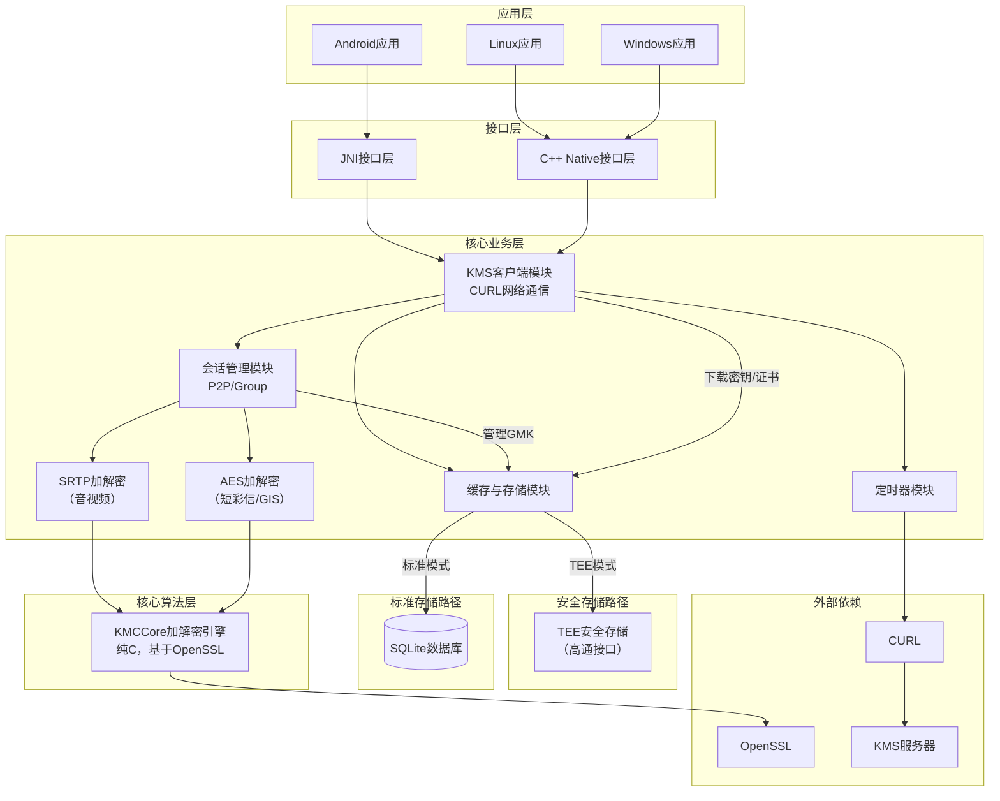
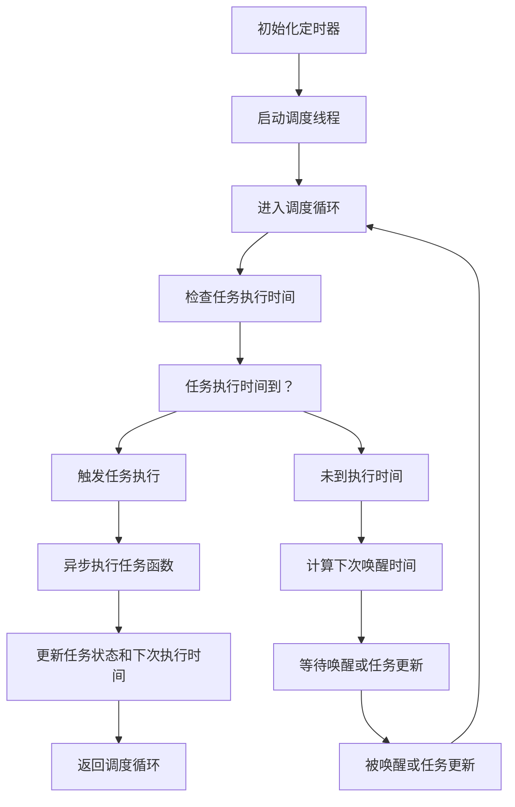
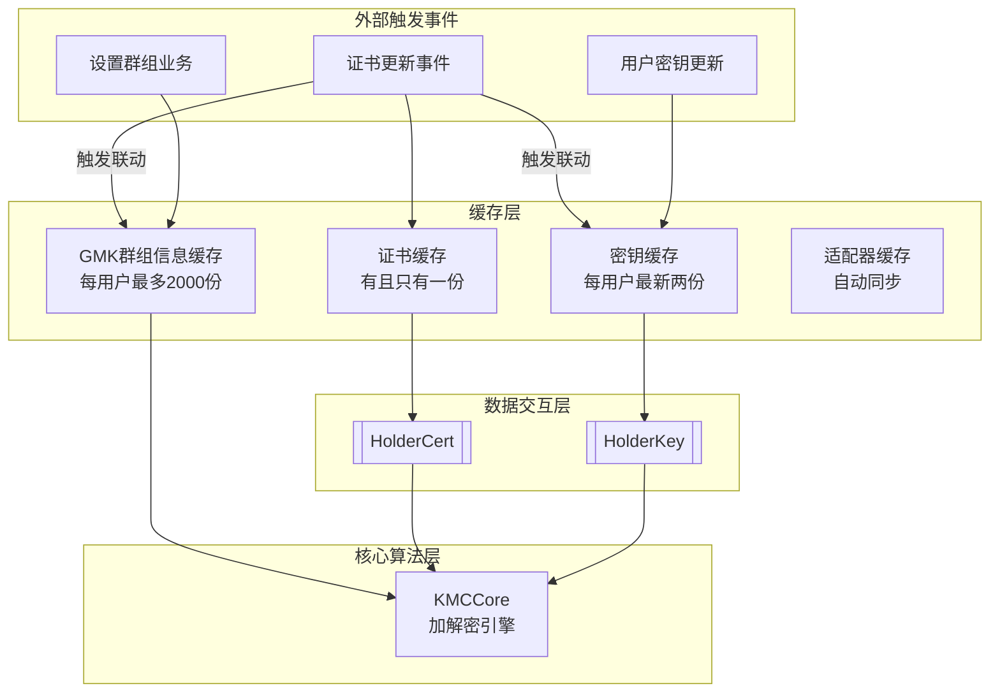
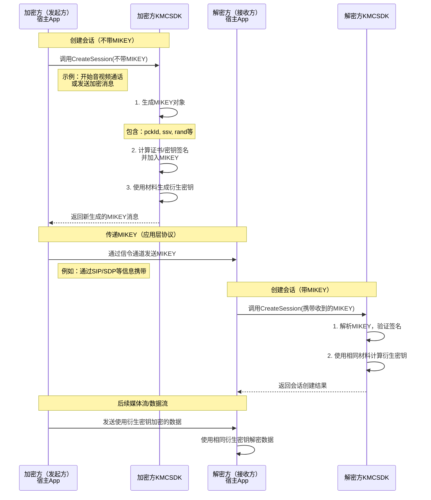

# 1. 概述

## 1.1 系统定位
kmccore（Key Management Core）位于华为安全通信系统的底层密钥管理层，作为 **JNI 桥接层**，负责把上层 Java SDK（kmcsdk）映射到 C/C++ 实现的密钥材料管理、MIKEY‑SAKKE 协商、SRTP 加解密、网络交互以及可信执行环境（TEE）安全存取。其核心价值在于：

- **统一密钥生命周期管理**：包括证书、用户密钥、群组 GMK 的获取、缓存、持久化与安全销毁。  
- **加解密**：基于 SRTP、AES‑GCM、ECCSI‑SAKKE 实现端到端媒体加密，满足实时通信的低时延要求。  
- **安全可信**：提供 TEE（QSEE）接口，实现密钥材料的硬件根保护，防止泄露。  
- **跨平台兼容**：通过 JNI 兼容 Android、Linux、Windows 等多平台，统一日志、错误处理与配置。

## 1.2 核心交互
因为我主要实现的是下载这一块的逻辑，我以我主要了解的内容来讲解，大致的流程上图所示




# 2. 功能清单

| 功能清单 | 功能说明 | 接口样式
|----------|----------|----------|
| 初始化 SDK | 加载日志，初始化华为kmc，创建数据库连接池，启动定时器，分配内存 |InitKmc(...)
| 去初始化 SDK | 释放数据库连接池，停止定时器，释放内存|FinalizeKmc(...)
| tee开关切换 | 切换tee开关 |TeeSwitch(...)
| 在线下载密钥证书 | 在在线模式下向kms请求下载密钥和证书 |StartDownloadKeyMaterial(...)
| 离线设置密钥证书（非加密） | 离线模式下，手动输入非加密的证书和密钥 |SetOfflineKeyMaterial(...)
| 离线设置密钥证书（加密） | 离线模式下，手动输入加密的证书和密钥 |SetOfflineKeyMaterialEncry(...)
| 停止下载活动 | 指定停止某个用户的下载活动 |StopDownloadKeyMaterial(...)
| 设置群组信息 | 设置群组信息 |SetGmkList(...)
| 删除群组信息 | 删除群组信息 |DeleteGmk(...)
| 查询群组信息 | 查询群组信息 |GetGmkList(...)
| 创建会话 | 在加解密业务之前，需要先创建对应的会话，来管理这些业务 |CreateSession(...)
| 生成新的mikey | 指定未某个会话生成新的mikey |GenNewMikey(...)
| 查询mikey | 查询某个会话的mikey |GetMikeyBySessionId(...)
| 释放会话 | 释放指定的某个会话 |ReleaseSession(...)
| 音视频加解密 | 利用srtp进行音视频加解密 |EncryptRtp(...)/DecryptSrtp(...)
| 短彩信gis加解密 | 使用aes对短彩信和gis加解密 |EncryptData(...)/DecryptData(...)
| 开启轮询开关 | 开启开关，可以指定一个时间，最小值5分钟，即每5分钟向kms请求询问一次是否要更新证书和密钥 |CertRefreshPollingToggle(...)

# 3.目录介绍
主要说下src/main/jni下的目录
```
code/Cpp/kmccore/src/main/jni
├─ core                     // kmccore实现
├─ ECCSI-SAKKE                     
├─ grp-keying-materials                   
├─ include                  // 三方库头文件
├─ kmclog                   // log4cpp的封装
├─ logic
│   ├─ include
│   │   ├─ Commstruct.h                            // 对外提供的头文件
│   │   ├─ KmcSvc.h                                // 接口内部实现
│   │   ├─ IKmcService.h                           // 对外提供的接口文件
│   ├─ src
│   │   ├─ cache                                   // 缓存实现
│   │   │   ├─ CacheManager.h                      // 会话管理的缓存
│   │   ├─ internal
│   │   │   ├─ FixedCache.h                        // 会话管理的缓存
│   │   │   ├─ InternalStruct.h                    // 会话管理功能的核心数据结构
│   │   │   ├─ KmcContextManager.h                 // kmc状态
│   │   │   └─ SessionManager.h                    // 会话管理
│   │   ├─ jni         
│   │   │   ├─KmcJNI.cpp                           // java层封装
│   │   ├─ manager         
│   │   │   ├─FixedCache.cpp                       // internal中对应的cpp文件
│   │   ├─ network                                 // httpclient 实现
│   │   │   ├─ KmsHttpManger.h / .cpp
│   │   │   ├─ KmsHttpsLogin.h / .cpp
│   │   │   ├─ KmsRequest.h / .cpp
│   │   │   ├─ KmsRespone.h / .cpp
│   │   ├─ storage
│   │   │   ├─ Sqlite3Manager.h / .cpp             // SQLite CRUD、事务、表初始化
│   │   │   └─ SqliteConnectionPool.h / .cpp       // 线程安全连接池、空闲回收
│   │   ├─ svc
│   │   │   ├─ EncryptSvc.cpp                      //加解密实现
│   │   │   └─ KmcSvc.cpp
│   │   ├─ timer                                   // 下载定时器实现
│   │   │   ├─ ScheduledTaskManager.h
│   │   │   └─ ScheduledTaskManager.cpp
│   │   ├─ utils                         
│   │       ├─ LocalDataEncryptUtils.h              //华为kmc接口封装
│   │       └─ ReaderWriterLock.h                   // 写优先读写锁实现
│   │       └─ kmcTeeStorage.h                      // tee接口封装
│   │       └─ GzipUtils.h                          //gzip封装
├─ open-source-module
│   ├─ base64.h
│   └─ base64.c                         // Base64 编码/解码实现
├─ tee
│   ├─ kmc-tee.c / kmc-tee.h            // 通用 TEE 接口（证书/材料存取、签名、SAKKE）
│   └─ qsee
│       ├─ kmc-qsee-ca.c / .h
│       ├─ kmc-qsee-test.c / .h
│       └─ qsee-ca-utils.c / .h        // QSEE 通信、ION 缓冲区、TA 启动、命令发送
└─ test
    ├─ TestStartDown.cpp                // 系统级自动化测试
    ├─ kmcDemo.cpp                     // 交互式 CLI 示例
    └─ testp2p.c                       // MIKEY‑SAKKE P2P 示例
```
# 4.部分实现的细节
## 4.1 定时器
定时器：大致流程


## 4.2 缓存
缓存的对象包含：



每个用户的gmk缓存最大为2000份，这部分逻辑我觉得还是需要调整，缓存给的太大了，后续看如何调整

# 5.踩坑经验和排查经验
## 5.1 一些比较麻烦的问题单：
    华为kmc导致kmc初始化失败：DTS2025101429311，这个问题并不是修改代码解决的，而是需要修改环境
    log4cpp崩溃问题：DTS2025102445739,这个目前已修复，具体原因是mylog封装中使用了全局变量导致的初始化顺序不一致，导致崩溃的
    windwos下部分代码表现不一致：DTS2025102224881，DTS2025110530265,DTS2025110340178,因为windwos和linux的编译器的差异性，导致一些潜在的问题，会更容易在windwos上暴露，书写代码经量保证良好规范，存量代码建议增加静态扫描，修复可能存在的问题。
## 5.2 排查手段
    1.kmc作为加密中间件，需要加解密两端对加解密材料和数据，在排查中也是很依赖日志
    

         一般做加解密流程时，都会先创建会话，我们创建会话也分带mikey创建会话和不带mikey创建会话，一般都是加密方是创建不带mikey的会话，调用createseesion接口后，会新生成一个mikey,生成mikey的同时也会对证书和密钥计算签名，并且将签名加到mikey中去，再由udc将mikey发送给对端，对端解密就用这个mikey去创建会话，并且根据mikey中签名进行验签，从而保持双方加解密材料一致，这个mikey里面主要的几个加解密材料分别是pckId,ssv,rand字段,然后加解密双方会用这几个材料去计算生成衍生密钥，最终双方用这个衍生密钥去加解密，这些步骤中涉及的数据我们都要去排查。
        这些字段再不同的业务中叫的名字不一样
        PCK-ID:32位bit，前4bit 'purpose tag'表示KEY的类型，1表示PCK-ID。后28bit为随机值。
        PCK: 点呼秘钥，由主叫用户生成，为随机值（安全性需满足RFC4086要求），按协议最长为128bit。
        在我们代码里pck就是ssv,点呼叫pck,组呼叫gmk,点呼叫：pck-id，组呼叫gmk-id

    2.如果本地可以拿到对应密钥和证书我们也可以自己去解析mikey，从而去验证mikey中的数据是否符合期望，可以通过SetGmkList接口，本地传参数,去解析。


