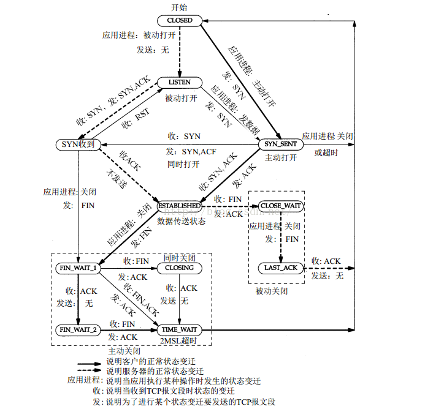
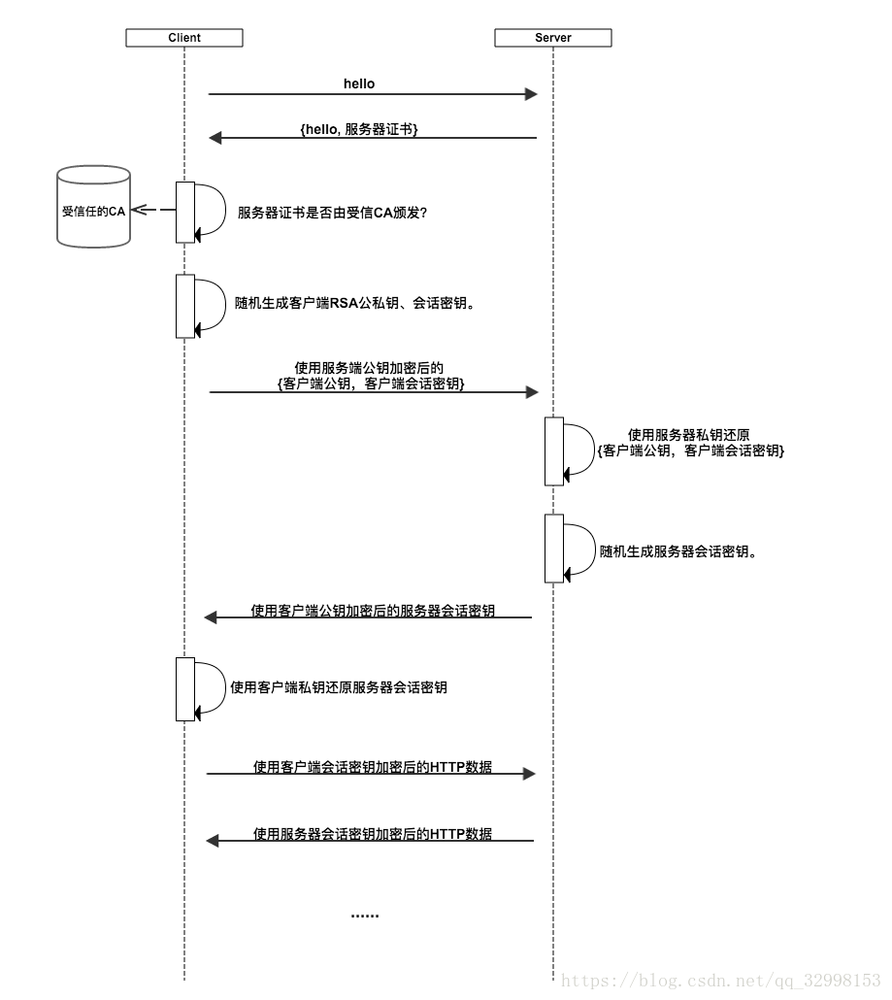
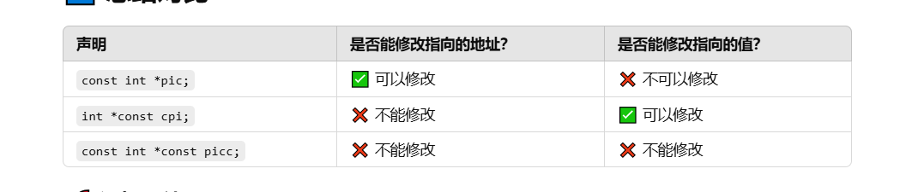
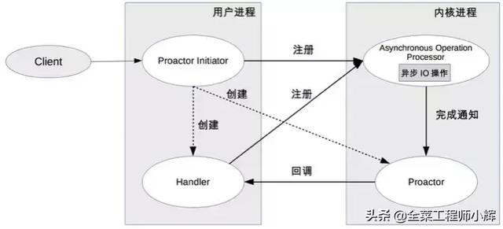

# 算法

## **1.单链表排序**：用冒泡排序实现，链表不支持随机查询，但冒牌排序是每次都会将数组或者链表重新遍历一遍

动图参考：<https://blog.csdn.net/meibenxiang/article/details/92796909?ops_request_misc=%257B%2522request%255Fid%2522%253A%2522162631017616780262575684%2522%252C%2522scm%2522%253A%252220140713.130102334..%2522%257D&request_id=162631017616780262575684&biz_id=0&utm_medium=distribute.pc_search_result.none-task-blog-2~all~top_positive~default-2-92796909.first_rank_v2_pc_rank_v29&utm_term=%E6%8E%92%E5%BA%8F%E7%AE%97%E6%B3%95&spm=1018.2226.3001.4187>

````    c++
typedef struct ListNode{
    int data;
    ListNode* next;
}ListNode;

void selectionSort(ListNode* head){
    ListNode* cur1 = head;
    int len = 0;
    while (cur1 != nullptr)
    {
        cur1 = cur1->next;
        len++;
    }
    ListNode* cur2 = head;
    for(int i = 0; i < len - 1; ++i){
        cur2 = head;
        for(int j = 0; j < len - i - 1; ++j){
            if(cur2->data > cur2->next->data){
                int tmp = cur2->data;
                cur2->data = cur2->next->data;
                cur2->next->data = tmp;
            }
            cur2 = cur2->next;
        }
    }
}
````

## 链表算法问题思路总结

1. 链表无法高效获取长度，不利于随机访问（双指针思路）

2. 链表倒数第k个元素：定义两个指针指向头节点，p,q,先让q移动k个元素，让p，q之间的距离变为k，然后开始同时移动两个指针，当q为null时，q就是倒数第k个节点了

3. 获取链表中间的元素节点：还是q，p两个指针，q每次移动2个节点，p每次移动一个节点，当q为最后一个节点时（q->next!=NULL），p就是中间的节点

4. 判断链表是否有环：q，p双指针，q每次移动两个元素，p每次移动一个元素，如果有环，一定会相遇，如果没有环，q会遇到NULL，之间返回。

## 不借助临时变量交换值

```c++
Void swap(int &a, int &b){
	b = a + b;
	a = b – a;
	b = b – a;
}
```


## 排序算法

空间复杂度 时间复杂度 最坏时间复杂度

1. 冒泡排序： O(1) O(n*n) O(n*n)

2. 选择排序 O(1) O(n*n) O(n*n)

3. 快速排序 O(logn) O(nlogn) O(n*n)

4. 堆排 O(1) O(nlogn) O(nlogn)

```c++
//智能指针
template<typename T>
class SmartPointer{
    private:
    T* p_;
    size_t* count_;
    public:
    SmartPointer(T* ptr = nullptr) : p_(ptr){
        if(p_){
            count_ = new size_t(1);
        }
    }

    SmartPointer(const SmartPointer& ptr){
        p_ = ptr.p_;
        count_ = ptr.count_;
        (*count_)++;
    }

    SmartPointer operator=(const SmartPointer& ptr){
        if(p_ == ptr.p_){
            return *this;
        }
        if(p_){
            if(--(*count_) == 0){
                delete p_;
                delete count_;
            }
        }
        p_ = ptr.p_;
        count_ = ptr.count_;
        (*count_)++;
        return *this;
    }
    ~SmartPointer(){
        if(--(*count_) == 0){
            delete p_;
            delete count_;
        }
    }
};

//快排
void quickSort(vector<int> &vec, int left, int right){
    if(left > right) return;
    int base = vec[left];
    int i = left, j = right;
    while(i < j){
        while(vec[j] >= base && i < j)
            --j;
        while(vec[i] <= base && i < j)
            ++i;
        if(i < j)
            swap(vec[i], vec[j]);
    }
    vec[left] = vec[i];
    vec[i] = base;
    quickSort(vec, left, i - 1);
    quickSort(vec, i + 1, right);
}

//堆排
//下标为i的节点的父节点：(i - 1) / 2
//下标为i的节点的左节点:(i * 2) + 1
//下标为i的节点的右节点:(i * 2) + 2
void heapify(vector<int> &vec, int length, int i){
    int largest = i;
    int lson = (i * 2) + 1;
    int rson = (i * 2) + 2;
    if(lson < length && vec[largest] < vec[lson])
        largest = lson;
    if(rson < length && vec[largest] < vec[rson])
        largest = rson;
    if(largest != i){
        swap(vec[largest], vec[i]);
        heapify(vec, length, largest);
    }
}

void head_sort(vector<int> &vec, int lenth){
    //创建堆
    for(int i = lenth / 2 - 1; i >= 0; --i)
        heapify(vec, lenth, i);
    for(int i = lenth - 1; i > 0; --i){
        swap(vec[i], vec[0]);
        heapify(vec, i, 0);
    }
}

//冒泡排序

void bubbleSort(vector<int> &vec) {
int len = vec.size();
for (int i = 0; i < len - 1; ++i) {
for (int j = 0; j < len - 1 - i; ++j)
if (vec[j] > vec[j + 1])
swap(vec[j], vec[j + 1]);
}
}

//选择排序
void selectionSort(vector<int>& vec) {
int len = vec.size();
int minIndex;
for (int i = 0; i < len - 1; ++i) {
minIndex = i;
for (int j = i + 1; j < len; ++j) {
if (vec[j] < vec[minIndex])
minIndex = j;
}
swap(vec[i], vec[minIndex]);
}
}
```

# 计算机网络
## Tcp/ip协议，以及每层的传输协议

OSI7层模型：

应用层(提供用户接口)：FTP, SNMP HTTPS, Telent,SSH

表示层(数据格式转换)：SSL/TLS,JPEG，ASII

会话层（维持会话连接）：PPTP,RPC

传输层(可靠、不可靠传输)：TCP, UDP，端到进程间的通信，提供数据传输服务

网络层（IP地址，路由）：IP, ICMP, IGMP，ARP ，端到端通信

数据链路层（mac地址，帧传输）：ethernet（以太网），vlan，mac 设备到设备通信

物理层（物理传输介质）：光纤，电缆，无线信号

Tcp/ip四层模型：应用层，传输层，网络层，数据链路层&物理层

## ip地址格式

1. 10.0.0.0-10.255.255.255属于私有地址，不能用于公网上

2. 举例192.168.1.255/24，24指的是子网掩码255.255.255.0，前24位为网络号，剩余8位为主机号，子网掩码决定网络范围，主机号全为0（指二进制）为子网，主机号全为1（指二进制）为子网的广播地址。255.255.255.255是所有的主机的广播地址，所有网络上的设备都能接受。

3. A，b，c，d，e类ip地址的区间范围

| **类别** | **范围（第一段）** | **默认子网掩码** | **网络-主机位** | **用途** |
|:---|:---|:---|:---|:---|
| **A 类** | 1.0.0.0 - 126.0.0.0 | 255.0.0.0 (/8) | 1字节网络号 + 3字节主机号 | **大规模网络**（如 ISP） |
| **B 类** | 128.0.0.0 - 191.255.0.0 | 255.255.0.0 (/16) | 2字节网络号 + 2字节主机号 | **中等规模网络** |
| **C 类** | 192.0.0.0 - 223.255.255.0 | 255.255.255.0 (/24) | 3字节网络号 + 1字节主机号 | **小型网络（企业、家庭）** |
| **D 类** | 224.0.0.0 - 239.255.255.255 | **无子网掩码** | **用于多播（Multicast）** | **组播地址** |
| **E 类** | 240.0.0.0 - 255.255.255.255 | **无子网掩码** | **保留（实验用途）** | **未来用途** |

## http状态码

1. 200：请求成功，用于get，post。

2. 301：永久移动，请求的资源已经被永久移动到新的url上面了，返回新的url，并自动刷新到新的url上。

3. 302：临时移动，资源只是被临时移动，应继续使用原先的url

4. 401：请求验证用户身份

5. 403：服务器拒绝执行请求

6. 408：服务器等待客户端发送请求时间过长，超时。

7. 499：客户端被关闭，可能服务器处理时间过长 ，不耐烦了。

8. 500：服务器内部错误，无法完成请求。

9. 502：作为网关或者代理工作的服务器程申请请求时，远程服务器返回一个无效响应

## 搜索百度，过程，dns解析过程

1. 输入url，dns会把url转换成ip地址，dns会查询本地有没有缓存，没有缓存，再去查操作系统hosts文件，没有再询问本地dns服务器，还是没有，<u>本地dns服务向域名根域名服务器发送查询请求，根域名返回一级域名，然后再往一级域名发出查询请求……直到得到ip地址</u>（这个叫递归查询，还有个是迭代查询），然后要建立http连接，http生成get请求报文，报文发送给传输层

2. http是基于tcp的。tcp会把报文分片发给网络层

3. 网络层通过ip协程将报文在路由器中发送。

4. 如果在同一个网段，是会通过数据链路层的arp协议进行寻址传输的。

## Tcp如何保证可靠

- 序列号，确认号

- 超时重传：如果发送方没收到确认应答，过一段时间会重传。

- 拥塞控制

   一开始，发送方维持一个拥塞窗口cwnd，还有一个慢开始门限ssthresh，当cwnd小于慢开始门限，慢开始算法，指数增长，cwnd大于了慢开始门限，采用拥塞避免算法，常数增长。

   如果这时，网络拥塞，慢开始门限ssthresh被设置为阻塞时cwnd的一半，cwnd重新开始增长

   这当中有个快重传和快恢复，如果网络阻塞时，连续收到3次重复确认，就表明当前网络环境还可以，直接将cwnd设置为慢开始门限，然后采用拥塞避免算法。

- tpc滑动窗口机制

  ​	简单理解就是发送端和接收端各维持一块缓存区，可以一次性处理更多的数据，而不是一个一个发送和确定，提高通信效率

  ​	发送方维持一块缓存区，表示连续可发送的数据大小

  ​	接收方维持一块缓存区，表示可以连续接受的数据大小，并且通过ack告知发送方剩余的缓存区大小

  ​	如果在发送多个数据包时，有缺失，此时会进行重传，重传机制包括（快速重传（接收方检测到1001-2000数据包丢失，会连续发送三次相同ACK=1001）和超时重传），重传的时候滑动窗口会暂停滑动

## TCP 粘包和拆包的原因

**（1）粘包原因**：导致粘包的根本原因是因为tcp字节流无边界的特性，TCP 将应用层传递的数据视为**连续的字节序列**

​	eg：tcp协议只保证数据能够准确的发送和接受，但不保证是否连续，发送方调用send()发送"hello","world"，对于用户和应用层来说，hello是一个数据包，world是一个数据包，但tcp并不管，tcp发送出去的时候就可能使"helloworld"一次性发送出去或者“hel"和"loworld”两次发送但不连续，以及更多的情况，因此应用层需要自己保证数据是逻辑上的连续，tcp只保证能准确无误的发送出去和接受。

> **发送端**：

- 应用层写入数据过快，TCP 会合并多个小数据包一起发送，提高网络利用率。（滑动窗口）

- Nagle 算法启用时，小数据可能会被合并到一个 TCP 报文中。

> **接收端**：

- 接收端 recv() 读取数据不及时，导致多个 TCP 报文堆积在缓冲区，一次性读取多个数据包。（滑动窗口）

**（2）拆包原因**

- **MTU 限制**：IP 层最大传输单元（MTU，通常 1500 字节）限制了单个 TCP 数据包的大小，超过 MTU 就会被拆分。
- **数据包过大**：应用层发送的数据超过 TCP 发送窗口大小，导致数据被拆分成多个 TCP 报文发送。
- **网络拥塞**：网络层可能对大数据包进行分片传输，接收端需要重组数据。
- **滑动窗口**：接受方的缓存区过小了。

**（3） TCP 粘包与拆包示例**

假设客户端依次发送 3 个消息：

[Hello] [World] [ChatGPT]

但由于粘包问题，接收端可能收到：

[HelloWorld] [ChatGPT]

或由于拆包问题：

[Hel] [loWor] [ldChatGPT]


## Websocket和http

Websocket通过http进行一次性握手后，建立连接，然后采用帧的方式传输数据，服务器和客户端都可以主动传输数据，无需等待，通过心跳，以及底层tcp定期检测保持连接，并且有断开自动重连功能onclose事件，适用于即时通信，直播弹幕，聊天客服等，但并不能取代http

| **缺点** | **影响** | **解决方案** |
|:---|:---|:---|
| **服务器资源消耗高** | 长连接占用内存、TCP 连接 | 连接池、清理无效连接 |
| **代理和负载均衡兼容性差** | 传统 HTTP 代理不支持 | 使用 Nginx / HAProxy WebSocket 代理 |
| **防火墙可能拦截** | 企业网络可能禁止 | 使用 wss:// 端口 443 连接 |
| **不适合短连接** | HTTP 请求比 WebSocket 高效 | API 用 HTTP，推送用 WebSocket |
| **开发复杂** | 需要自己管理连接 | WebSocket 框架、自动重连 |
| **可靠性问题** | 没有内置消息确认 | 使用 ACK 机制、消息队列 |
| **安全风险** | WebSocket 可能被劫持 | wss:// + Origin 头检查 |

## 网络编程一般步骤

1 服务器端：创建socket， bind绑定端口，ip， listen监听客户端 accept建立连接 read write close

2\. 客户端：创建socket bind绑定端口 write read close

## Tcp连接状态图，以及挥手握手过程



客户端的状态变迁：CLOSED-->SYN_SENT-->ESTABLISHED-->FIN_WAIT_1-->FIN_WAIT_2-->TIME_WAIT-->CLOSED

服务器的状态变迁：CLOSED-->LISTEN-->SYN_RCVD-->ESTABLISHED-->CLOSE_WAIT-->LAST_ACK--->CLOSED

| **当前状态** | **触发条件** | **下一状态** | **所属对象** | **发起方** |
|:---|:---|:---|:---|:---|
| **CLOSED** | 客户端应用调用 connect() | **SYN_SENT** | **客户端** | **客户端主动** |
| **LISTEN** | 服务器收到 SYN | **SYN_RECEIVED** | **服务器** | **客户端主动** |
| **SYN_SENT** | 收到 SYN + ACK | **ESTABLISHED** | **客户端** | **服务器响应** |
| **SYN_RECEIVED** | 收到 ACK | **ESTABLISHED** | **服务器** | **客户端响应** |
| **ESTABLISHED** | 客户端应用调用 close()，发送 FIN | **FIN_WAIT_1** | **客户端** | **客户端主动** |
| **FIN_WAIT_1** | 服务器收到 FIN 并发送 ACK | **FIN_WAIT_2** | **客户端** | **服务器响应** |
| **FIN_WAIT_1** | 服务器直接发送 FIN + ACK | **CLOSING** | **客户端** | **服务器主动** |
| **FIN_WAIT_2** | 收到 FIN | **TIME_WAIT** | **客户端** | **服务器主动** |
| **CLOSE_WAIT** | 服务器收到 FIN，等待应用层处理 | **CLOSE_WAIT** | **服务器** | **客户端主动** |
| **CLOSE_WAIT** | 服务器应用层调用 close()，发送 FIN | **LAST_ACK** | **服务器** | **服务器主动** |
| **LAST_ACK** | 收到 ACK | **CLOSED** | **服务器** | **客户端响应** |
| **CLOSING** | 收到 ACK | **TIME_WAIT** | **客户端** | **服务器响应** |
| **TIME_WAIT** | 经过 2 * MSL（最大报文生存时间） | **CLOSED** | **客户端** | **超时触发** |

| **状态**    | **说明**                                    |
|:------------|:--------------------------------------------|
| CLOSED      | 连接关闭状态（初始状态和最终状态）          |
| LISTEN      | 服务器监听客户端连接                        |
| SYN_SENT    | 客户端主动连接，发送 SYN 请求               |
| SYN_RCVD    | 服务器收到 SYN，回复 SYN + ACK              |
| ESTABLISHED | 连接建立成功，数据传输进行中                |
| FIN_WAIT_1  | 客户端主动关闭，发送 FIN                    |
| CLOSE_WAIT  | 服务器收到 FIN，等待应用程序处理            |
| FIN_WAIT_2  | 客户端收到 ACK，等待服务器 FIN              |
| LAST_ACK    | 服务器发送 FIN，等待 ACK                    |
| TIME_WAIT   | 客户端收到 FIN，发送 ACK 并等待 2*MSL 时间 |
| CLOSED      | 连接完全关闭                                |


三次握手：

- 前两次握手完成以后，服务器第一次收到客户端的syn后，此时处于半连接状态，服务器会将这个客户端放在半连接队列，**SYN攻击**就是利用的半连接这一点，客户端在短时间伪造大量的不存在ip去发送syn，服务器会回复ack并等待客户端的ack，而客户端的ip地址不存在，是不会回复ack的，而服务器会一直等待客户端的回复直到超时，导致半连接队列长时间被占用，以至于正常的客户端连接不上服务器
- 三次握手完成，就会放在全连接队列
- 三次握手也是可以携带数据的，但第一次和第二次不能携带数据的，第三次可以，如果第一次和第二次携带数据，就可以利用这一点，大量客户端给服务器发送syn，并携带大量数据，服务器不仅要处理连接还要处理数据包，导致服务器内存cpu占有率高


四次挥手：

- 四次挥手谁都可以先发起，不一定是客户端
- 2MSL等待，这个机制是为了保证服务器收到ack，因为客户端并不知道服务器到底收到ack没有，如果没收到，服务器会重发fin，因此需要等待一点时间
- 握手只需三次，为什么挥手要四次：当客户端发送fin，服务器收到fin，很可能socket套接字里面数据还没处理完，因此就相当于先标记个状态，我先把数据发送或者接收完，服务器再给客户端也发起同步的fin，再关闭连接，三次握手可以收到ack直接再一并发起syn，是因为没有数据需要处理，因此可以马上建立连接


Tcp三次握手是保证连接的可靠性，四次挥手是保证数据发送完了再断开连接，避免数据丢失

拥塞控制：慢启动，拥塞避免，快速重传，快速恢复

慢启动：发送方维护拥塞窗口（cwnd），初始值为1，每收到一个ack就指数增长 ，直到到达慢启动阈值（ssthresh)，进入拥塞避免阶段

拥塞避免：当cwnd超过ssthresh时，不再指数增长，改为线性增长，直到发生丢包，或者超时重传

快速重传：当发送方，连续接受到3个相同ack，就立即重传数据包。

快速恢复：指的是当重传的时候，不再慢启动，cwnd不再从1开始，直接从ssthresh的一半开始

滑动窗口：防止发送发过快的发送数据，导致接受方处理不过来，主要维护两个缓存区，发送窗口（发送方允许发送但未确认的数据范围，值：swnd = min(cwnd, rwnd)），和接受窗口（接收方可以接收的最大数据量（值由 rwnd 设定，TCP 头部的 Window 字段通知发送方当前的 rwnd））

Nagle 算法：减少**小数据包的数量**，提高传输效率，当有多个小数据包，会合并成一个大包发送，提高吞吐量，适用于日志数据

TCP_NODELAY：禁用 Nagle 算法，**立即发送数据包**，降低延迟，不等待ack，数据实时发送，适用于游戏

## Https加密传输过程

http端口80，https端口443

1. 两个概念： 对称加密：加密解密用的都是同一个密钥

> 非对称加密：一个公钥，一个密钥，公钥任何人都拿的到，自己会有一份独一的密钥，其他人不可见，公钥加密，传送数据，然后用自己的密钥解密。

证书：为了确保公钥是从服务器发来的，且是货真价实的。

https除了建立3次握手，再3次握手之前还需要进行SSL加密握手，速度会慢很多。

2. 流程：非对称加密协商，对称加密传输

    1) 认证服务器，开发商在开发浏览器的时候，会在浏览器里面存放一个CA机构证书表，表中记录的那些CA机构证书是值得信任的。客户端发出连接请求，服务器会返回一个由CA机构认证的服务器证书，客户端拿到证书，查询自己的CA表，如果这个CA机构在表中，且服务器证书的信息与当前访问的ip一致，就认为该证书可信，然后从服务器证书中获取服务器的公钥。

    2) 协商会话密钥，客户端和服务端会协商两个会话密钥，一个是客户端往服务端发送数据的会话密钥，另一个是服务端往客户端发送数据的会话密钥，这两个都是对称密钥。客户端通过公钥加密客户端往服务端发送数据的密钥，和自己公钥，然后服务器用自己的私钥解密后，通过客户端的公钥加密服务端往客户端发送数据的密钥，客户端用自己私钥解密。协商的密钥每次都是随机的。

    3) 传输数据，然后客户端和服务端就是通过两个密钥进行传输数据，这样做的好处就是，对称加密比较节约计算资源，能让传输速度更快。

## CDN（内容分发网络）加速

| **关键点**     | **作用**                               |
|:---------------|:---------------------------------------|
| **CDN**        | 通过全球分布的边缘服务器加速内容传输   |
| **边缘服务器** | 靠近用户的缓存节点，减少访问延迟       |
| **缓存机制**   | 通过**强制缓存、协商缓存**减少重复请求 |
| **智能路由**   | 选择**最近的服务器**，优化访问速度     |

CDN 适用于：

- **视频网站（YouTube、Bilibili）**：减少视频加载时间

- **电商网站（淘宝、亚马逊）**：加速图片和商品页面加载

- **游戏加速（Steam、腾讯游戏）**：减少延迟，提高下载速度

- **全球新闻/社交平台（Twitter、Facebook）**：提高数据同步效率

## 负载均衡

### **负载均衡算法对比**

| **算法** | **优点** | **缺点** | **适用场景** |
|:---|:---|:---|:---|
| **轮询（Round Robin）** | 简单易实现，适用于短连接 | 服务器负载可能不均衡 | 适用于 HTTP 短连接 |
| **最小连接（Least Connections）** | 适用于长连接，负载均衡效果好 | 需要额外记录连接数，增加计算开销 | 适用于数据库、WebSocket |
| **哈希（IP Hash）** | 保证同一 IP 请求落在同一服务器，保持会话 | 负载可能不均衡，某些服务器可能压力过大 | 适用于用户会话保持，如支付、认证 |

轮询：请求**依次分配**给服务器，按照**循环**的方式轮流分配。适用于**性能相近**的服务器集群。

最小连接：**优先分配**请求给**当前活跃连接最少**的服务器。适用于**长连接请求**（如数据库查询、WebSocket 连接等）。

哈希：通过**对客户端 IP 进行哈希运算**，决定请求分配到哪台服务器。确保同一 IP 的请求始终分配到同一服务器（**会话保持**）。

# 数据库

## 隔离级别

1. 未提交读：一个事务在提交前，对其他事务是可见的，就是说一个事务可以读到另一个事务还没来得及提交的数据，存在脏读

2. 提交读：一个事务在提交前，对其他事务是不可见的，解决脏读，但在存在不可重复读的问题，在两次查询之间，有事务被提交，两次查询结果不一样

3. 可重复读：同一个事务对一份数据读取的结果总是一致的，解决不可重读读，但存在幻读（两次查询之间，有其他事务对数据进行插入或者删除）（mysql默认）

4. 可串行化：一个事务一个事务处理，这个事务处理完了，下个事务才会开始，速度很慢。

## 数据库处理并发问题

1. 共享锁：类比读锁

2. 排他锁：类比写锁

3. 加锁策略：表锁，对整张表加锁，开销小，并发低 行级锁：对每条一行记录加锁，开销大，并发高

4. InnoDB MVCC：为了不加锁实现的一个机制，在每条记录后面会加两个隐藏列：记录的创建时间，过期时间。在插入删除修改时，通过这两个隐藏列来避免脏读，不可重复读，幻读的问题。

## 数据库事务的一致性

1. 原子性：数据库事务是一个整体，要么成功，要么失败

2. 一致性：数据库事务总是从一个状态变为另一个状态

3. 持久性：事务一旦提交，造成的修改是永久性的

4. 隔离性：事务之间彼此相互不影响

## 索引

B+树：b树每一个节点里面存放的是2个数据，b+树每个结点存放的是索引，索引可以放多个，b+树叶子节点存放的是具体数据，最后一层数据再通过一个链表串起来。B+树默认有序，索引速度O(logn)

哈希：哈希索引速度很快O(1)，默认无序，（注意哈希冲突，链地址法解决）

## 数据库引擎

InnoDB：最通用的引擎，支持事务、行级锁，热备份，MVCC，在并发上占优势，系统占用资源多，不支持全文索引，支持外键，索引：b+树，哈希。

MyISAM：默认的引擎，不支持事务、行级锁，有表锁，查询速度很快，系统占用资源少，支持全文索引，不支持外键，索引：b+树。

## 三大范式

1. 第一范式：每一列都要是不可拆分的整体

2. 第二范式：确保每列都要与主键相关

3. 第三范式：确保每列都要与主键直接相关

> 为什么要满足范式：可以使冗余小，结构合理，但不利于查询。

## 索引的底层实现

1. InnoDB建表，并添加了索引：生成的文件.frm文件（建表的语句）和.idb文件（索引文件和数据文件）,聚集索引。

2. Myisam建表，并添加索引：生成.frm文件（建表的语句），.MYD文件（Myisam data 数据文件）和.MYI（Myisam idex索引文件），非集聚索引。

3. Myisam引擎底层（非聚集索引）：建表以主键key建立索引b+树，叶子节点存放具体数据。当为其他字段添加索引，也是建立该索引的b+树，然后叶子节点存放数据。

4. InnoDB引擎底层（聚集索引）：首先会根据主键建立b+树，然后叶子节点存放具体数据，如果其他字段有索引，为这个字段建立索引b+树，但是叶子节点存放的是主键索引的key，要在去主键索引b+树中查找一次，才能找到具体数据。

5. 差异：因为聚集索引和非聚集索引的差距：使Misam查找速度快，浪费更多空间（一般只需查找一次，每个索引都存放着具体数据），InnoDB查找慢一点，但节省空间（一般要查找两次，除了主键索引，其他所有存放的是主键中的索引key）

## 什么情况才需要添加索引

1. 需要频繁更新的数据不利添加索引

2. 区分度不够的索引不利于添加索引（比如性别）

3. 频繁作为查询的字段应该添加索引

# C++语法

## 虚函数，虚函数表，虚函数指针

c++类可以通过关键词virtual定义虚函数

当类种有虚函数，编译器就会为这个类创建一个虚函数表，里面记录着虚函数的地址，当有派生类重载了虚函数，这个派生类的虚函数地址就变为子类的虚函数地址

每个有虚函数类的对象，会存在一个虚函数指针，指向它所属的虚函数表，运行时会动态绑定

## 数据结构

### map和unordered_map区别

|    **特性**    |              **map**              |        **unordered_map**        |
| :------------: | :-------------------------------: | :-----------------------------: |
|  **实现方式**  |    红黑树（自平衡二叉搜索树）     |   哈希表（链地址法解决冲突）    |
|  **元素顺序**  |   按键升序排列（中序遍历有序）    |    无序（依赖哈希函数分布）     |
|    内存开销    |               较高                |              较低               |
|    扩容机制    |          红黑树自动平衡           | 需 `rehash`（扩容时重新分配桶） |
| 插入/删除/查找 | O(logn)：随着数据规模变大而越耗时 |            O(1)-O(n)            |

unordered_map底层是是一个动态数组，每个元素代表一个桶，每个桶再通过链表将有冲突的哈希存储起来，因此再查找时，先遍历桶，再遍历链表对比key值
gcc优化：当链表过长度超过阈值时，gcc会将链表转成红黑树，使查找时间从O(n)变为O(logn)


unordered_map扩容机制：

首先触发扩容有个阈值，即元素数量/桶数量的比值，默认为1（即元素数量=桶的数量），在每次insert，emplace会校验这个阈值

扩容机制这个因编译器不同策略不同：gcc初始为8，后续按8的倍数递增(8-16-35),VS2019默认是13，后续按当前容量倍数增加(13-29-58)

扩容步骤：1.按照策略先申请足够大小的内存。2.旧元素重新计算哈希。3.将旧数据插入到新的哈希表，并释放旧内存

## std::atomic

用于多线程的原子操作，保证变量线程安全

atomic有6种内存序，分三类

- 自由顺序

  - memory_order_relaxed：仅保证原子性

- 获取-释放顺序

  - memory_order_acquire：保证当前操作之后的操作不会跑到   当前操作    前面执行
  - memory_order_release：保证当前操作之前的操作不会跑到   当前操作    后面执行
  - memory_order_acq_rel：综合上面两个，保证当前操作之前之后的不会跑到  当前操作  之前或者之后执行

  ```c++
  std::atomic<int*> ptr(nullptr);
  int data = 0;
  
  // 生产者线程（快递员打包发货）
  void producer() {
      int* p = new int(42);
      data = 100;               // 步骤1：准备包裹内容
      ptr.store(p, std::memory_order_release); // 步骤2：贴单发货（release保证步骤1不会重排到本操作之后）
  }
  
  // 消费者线程（收货人拆箱验货）
  void consumer() {
      int* p;
      while (!(p = ptr.load(std::memory_order_acquire))) {} // 步骤3：等待包裹（acquire保证步骤4不会重排到本操作之前）
      std::cout << "Data: " << data << ", *p: " << *p << std::endl; // 步骤4：读取内容
  }
  ```

  

- 顺序一致顺序

  - memory_order_seq_cst：默认内存序，所有线程操作按全局一致顺序进行，性能开销最大

```c++
#include <atomic>
#include <thread>

std::atomic<int> counter(0);

void increment() {
    for (int i = 0; i < 1000; ++i) {
        counter.fetch_add(1, std::memory_order_relaxed); // 原子递增
    }
}

int main() {
    std::thread t1(increment), t2(increment);
    t1.join(); t2.join();
    std::cout << counter.load(); // 输出 2000（正确结果）
}

常用操作：
load() 和 store() 用于原子读取和写入。
fetch_add()、fetch_sub() 实现原子加减。
compare_exchange_weak() 用于无锁算法中的条件更新。

```

### cas和mutex的区别

这两种都是并发中常用的同步机制

cas是一种无锁的原子操作，由硬件直接支持，避免了线程阻塞和上下文切换，性能高，但使用复杂

mutex是基于锁的同步机制，通过操作系统提供的系统库中的锁实现，容易理解，但性能损失多点

## c++11的一些tips

**1. 局部静态变量初始化的线程安全性**

C++11 标准规定，当多个线程首次同时调用包含局部静态变量的函数时，**初始化过程会被隐式同步**，确保只有一个线程执行初始化代码，其他线程会阻塞直到初始化完成。
这一特性常被称为 **"Magic Statics"**，其实现原理是编译器自动插入双重检查锁（Double-Checked Locking）或原子标记位机制。例如：

```cpp
// C++11 线程安全的单例模式实现
class Singleton {
public:
    static Singleton& getInstance() {
        static Singleton instance;  // 初始化由编译器保证线程安全
        return instance;
    }
private:
    Singleton() = default;
};
```

此时无需在 `getInstance()` 中手动添加锁或其他同步机制来保护初始化过程

​	局部静态变量初始化的线程安全性

一个pair对象是可以作为map的key，不过因为map是有序容器，因此这个pair必须自定义实现operator<的比较函数

## __attribute__((constructor))----gcc的特性

`__attribute__((constructor))` 是 GCC（GNU Compiler Collection）提供的一个编译器扩展，用于指定一个函数在程序启动时自动执行，即在 `main()` 函数执行之前。这个特性通常用于在程序初始化时执行一些必要的设置或资源初始化。

`__attribute__((constructor))` 用于标记一个函数，使得它在程序启动时自动执行，无需显式调用。被标记为 `constructor` 的函数会在程序的 `main` 函数之前执行。

```c
void function_name() __attribute__((constructor));
```

使用场景

- 初始化全局变量
- 配置程序环境
- 资源初始化，如打开文件、数据库连接等
- 注册全局的信号处理器

## lower_bound

`lower_bound` 是 C++ 标准库中的一个函数，用于在有序序列中查找第一个**大于或等于**给定值的元素的位置。它定义在头文件 `<algorithm>` 中，底层实现基于二分查找，因此效率较高

```c++
std::lower_bound(v.begin(), v.end(), target);

参数说明
	first 和 last：表示查找范围的迭代器，范围是 [first, last)。
	val：要查找的目标值。
	comp（可选）：自定义比较函数，用于定义排序规则。
​返回值
	返回一个迭代器，指向第一个大于或等于​ val 的元素。
	如果所有元素都小于 val，则返回 last。
```

**注意事项**

1. **序列必须有序**
   `lower_bound` 要求序列是**有序**的，否则结果未定义。如果序列未排序，可以先使用 `std::sort` 进行排序。

2. **自定义比较规则**
   如果需要自定义排序规则（例如从大到小排序），可以传入一个比较函数：

   ```cpp
   auto it = std::lower_bound(v.begin(), v.end(), target, std::greater<int>());
   ```

3. **处理未找到的情况**
   如果返回值等于 `last`，说明没有找到符合条件的元素。

## enable_shared_from_this

`std::enable_shared_from_this` 是 C++ 中用来安全管理对象生命周期的工具，可以简单理解为**让对象能“知道自己被智能指针管理了”，并且能安全地给自己“续命”**，一般用于需要再类里面返回this指针

### **核心功能**

1. **安全获取自己的智能指针**
   当一个对象被 `shared_ptr` 管理时，可以通过 `shared_from_this()` 方法获取指向自己的 `shared_ptr`，避免直接操作 `this` 指针导致崩溃。

   

2. **解决重复析构问题**
   直接通过 `this` 创建多个 `shared_ptr` 会生成独立的计数器，导致对象被多次销毁。`enable_shared_from_this` 确保所有 `shared_ptr` 共享同一个计数器

```c++
#include <memory>
#include <iostream>

class MyClass : public std::enable_shared_from_this<MyClass> {
public:
    std::shared_ptr<MyClass> getSharedPtr() {
        return shared_from_this();
    }
};

int main() {
    std::shared_ptr<MyClass> ptr = std::make_shared<MyClass>();
    std::shared_ptr<MyClass> ptr2 = ptr->getSharedPtr();
    std::cout << "ptr.use_count() = " << ptr.use_count() << std::endl; // 输出 2
    return 0;
}


#include <memory>
#include <iostream>

class SmartSpeaker : public std::enable_shared_from_this<SmartSpeaker> {
public:
    void StartTask() {
        // 获取自己的 shared_ptr，确保任务执行时对象存活
        std::shared_ptr<SmartSpeaker> self = shared_from_this();
        // 模拟异步任务（比如播放音乐）
        std::thread([self] {
            std::cout << "播放音乐中..." << std::endl;
        }).detach();
    }
};

int main() {
    // 必须用 shared_ptr 创建对象！
    auto speaker = std::make_shared<SmartSpeaker>();
    speaker->StartTask();  // 即使 speaker 销毁，任务线程仍能安全使用对象
    return 0;
}
```

### 注意事项

- **对象必须由 `shared_ptr` 管理**
  如果用 `new` 创建对象或直接栈上实例化，调用 `shared_from_this()` 会崩溃
- **不能在构造函数或析构函数中调用**
  构造函数中 `shared_ptr` 还未完全建立，析构函数中对象即将销毁，此时调用会出错
- **必须 public 继承**
  如果写成 `private` 或 `protected` 继承，编译器会报错

### **总结**

- **用途**：当对象需要把自己的指针传递给外部，且希望外部通过智能指针管理时。

- **核心**：用 `shared_from_this()` 代替 `this`，避免野指针和重复析构。

- **一句话**：如果你用 `shared_ptr` 管理对象，并需要在内部返回自己的指针，就用它！

  


## 模板

### 函数模板

1. 基本声明

```c++
template <typename T>//<class T>
T maxValue(T a, T b)
{
    return (a > b) ? a, b;
}
```

//使用

```c++
int a = maxValue(2, 7);//隐式调用
double b = maxValue<double>(1.1, 2.2);//显示调用
```

2. 多个参数

```c++
template<typename T1, typename T2>
void print(T1 a, T2 b)
{
    cout << a << b << endl;
}
```

3. 设定默认值

```c++
template <typename T = int>
T add(T a, T b) {
    return a + b;
}
```

4. 带非类型参数

```c++
template <typename T, int N>  // N 是非类型模板参数
T add(T a) {
    return a + N;
}
```

```c++
//使用

std::cout << add<int, 5>(10) << std::endl; // 5 + 10 = 15
```

### 类模板

1. 基本使用

```c++
template <typename T> class Box {
private:
  T m_value;
public:
  Box(T v) : m_value(v) {}
};
```

2. 类模板的非类型参数

```c++
//声明
template <typename T, int SIZE>
class Array {
private:
    T arr[SIZE];
public:
    void set(int index, T value) { arr[index] = value; }
    T get(int index) { return arr[index]; }
};

//使用
Array<int, 5> arr;  // 创建 5 个元素的 int 数组
arr.set(0, 10);
std::cout << arr.get(0);  // 输出 10
```

### 变量模板

1. 用于定义通用变量。

```c++
template <typename T>
constexpr T pi = T(3.1415926535897932385);
```

### 别名模板

为模板类型创建别名，简化使用。

```c++
template <typename T>
using Vec = std::vector<T>;
Vec<int> numbers; // 等价于 std::vector<int>
numbers.push_back(42);
```

模板特化

### 可变参数模板

```c++
template <typename... Args>  // 可变模板参数
void func(Args... args) {
    // 处理 args
}
```

• typename... Args **表示多个模板参数**，可以是任意类型的。

• Args... args **表示多个函数参数**，可接受任意数量的参数。

```c++
// 终止递归的基础函数
void print() {
    std::cout << "结束递归" << std::endl;
}

// 递归函数
template <typename T, typename... Args>
void print(T first, Args... rest) {
    std::cout << first << " ";
    print(rest...);  // 递归调用，展开参数包
}

int main() {
    print(1, 2.5, "Hello", 'A');  
}
```

• print(1, 2.5, "Hello", 'A') 会依次展开：

- print(1, 2.5, "Hello", 'A')

- print(2.5, "Hello", 'A')

- print("Hello", 'A')

- print('A')

- print()（终止递归）

• print() 是递归终止条件，否则编译器会报错。

## c++的锁相关语法

### 1.std::lock_guard和std::unique_lock

​	C++ 标准库中用于管理互斥锁（`std::mutex`）（当然，其他的锁只要满足互斥锁的概念也可以用）的 RAII 类模板,它们的主要目的是确保互斥锁在作用域结束时自动解锁，避免资源泄漏或死锁。

std::lock_guard

特点

- 简单易用：构造时锁定互斥锁，析构时自动解锁

- 不可手动解锁：一旦构造，只能再作用域结束自动释放

- 适用于简单场景：用于不用手动管理锁的场景

  ```c++
  std::mutex mtx;
  int shared_data = 0;
  
  void increment(){
      std::lock_guard<std::mutex> lock(mtx);
      ++shared_data;
      //作用域结束自动解锁
  }
  ```

std::unique_lock

特点

- 灵活性高：允许手动锁定/解锁互斥锁

- 延迟锁定：可以在构造时不锁定互斥锁，稍后再手动锁定

- 支持移动变量：change与std::condition_variable一起使用

- 可移动：可以通过移动语义转移锁的使用权

  ```c++
  std::mutex mtx;
  int shared_data = 0;
  
  void increment(){
      std::unique_lock<std::mutex> lock(mtx);
      ++shared_data;
      lock.unlock(); //手动解锁
      lock.lock();  //手动上锁
      ++shared_data;
      //作用域自动解锁
  }
  
  //延迟锁定
  void delayed_lock() {
      std::unique_lock<std::mutex> lock(mtx, std::defer_lock); // 构造时不锁定
      // 做一些不需要锁的操作
      lock.lock(); // 手动锁定
      ++shared_data;
      // 作用域结束时自动解锁
  }
  
  //与条件变量一起使用
  #include <condition_variable>
  
  std::condition_variable cv;
  bool ready = false;
  
  void wait_for_ready() {
      std::unique_lock<std::mutex> lock(mtx);
      cv.wait(lock, [] { return ready; }); // 等待条件变量
      ++shared_data;
  }
  
  void set_ready() {
      std::unique_lock<std::mutex> lock(mtx);
      ready = true;
      cv.notify_all(); // 通知等待的线程
  }
  ```

  

### 2.自旋锁

- 机制：线程一直循环检测锁的状态，直到锁被释放，通过忙等待和原子操作实现。
- 场景：用于锁占用时间短的场景

### 3.读写锁

- 机制：读锁共享，写锁独占，可以用c++17的std::shared_lock实现读锁，std::unique_lock实现写锁
- 场景：一般用于读多写少的场景

## Malloc New

Malloc在堆上申请内存，new在自由存储区上分配内存

Malloc失败返回Null，new失败会抛出异常

Malloc分配空间需要指定大小，new不用指定大小

Malloc不能触发对象的构造函数，new可以触发对象的构造函数

Malloc成功返回的是void*指针，一般需要强转下，new返回对应类型的指针。

## explicit

- `explicit` 只能用于构造函数，不能用于普通成员函数或其他函数。
- 对于单参数构造函数，推荐总是使用 `explicit`，除非有特殊需求需要允许隐式转换。
- 从 C++11 开始，`explicit` 也可以用于转换构造函数和模板构造函数。

## constexpr vs const

| **关键字** | **作用**   | **适用范围**             | **计算时间**     |
|:-----------|:-----------|:-------------------------|:-----------------|
| const      | 只读变量   | **变量、对象**           | 运行时或编译时   |
| constexpr  | 编译时常量 | **变量、函数、类、对象** | **必须是编译时** |

## Static关键词

局部static变量

只初始化一次，整个程序声明周期都存在，函数调用后也不会销毁

全局static变量

作用域是仅限当前.cpp文件，不会被其他文件访问，比全局变量要好点

static成员变量

所有对象共同使用同一个静态变量，不属于任何一个对象。并且是在类外部初始化

Static成员函数

只能访问静态变量，不能访问非静态变量，因为静态成员函数没有this指针，因此不能获取到非静态成员变量，静态函数可以不通过对象实例访问直接类名::函数名就可以访问

## C++特性

1. 多态：在有继承关系的类中，去调同一个函数(调用函数的对象要是指针或者引用，要有虚函数)，c++多态分为静态多态：函数重载，模板函数，动态多态：虚函数

2. 虚析构：设置了虚析构，当用父类指针指向子类时，父类指针销毁，也会调用到子类的析构，如果不是虚析构，就只会调用父类析构

3. 重载：函数名一样，函数参数不一样，返回值没有关系，重写：子类继承父类，子类重写父类的虚函数，返回值，函数名，函数参数都一样，内容不一样

4. 仿函数的作用：又叫函数对象，仿函数可以拥有自己的成员变量，有更好的速度。

5. 深拷贝，浅拷贝：有一个指针指向在堆上开辟的空间，如果之间将指针赋值，只是将这个堆上空间的地址给另一个指针，如果之前的指针释放了，那复制后的指针也就失去了那片内存，这是浅拷贝，只是单纯的赋值，深拷贝应该是要把要重新开辟堆上地址，然后把内容拷贝过去，再把这个地址赋给一个指针。

## mutable和volatile

volatile：表示编译器不会对volatile声明的变量优化，从而让它可以稳定访问某一个值

mutable：mutable声明的变量表示一直处于可变的的状态，即使在const函数中。

## Inlie

Inlie函数，有点类似于宏，inlie被声明后，在被调用的地方进行代码展开，省去了函数栈的操作，inlie保留了函数的性质，在类中声明并定义可以访问类的变量，可以被调试，宏不行。

Inlie只是建议，是否内联要看编译器。

## 智能指针

1. Shared_ptr：有共享的概念，内部有个引用计数，会记录当前有多少个Shared_ptr指向这个对象，可以通过unique_ptr,weak_ptr来构造，也可以自己new。Reset成员函数，使引用计数减一，作用放弃当前智能指针

2. Weak_ptr：这个主要是配合shared_ptr使用的，对已经被shared_ptr引用的对象，再加weak_ptr，不会使引用计数加一。不能直接通过weak_ptr去访问对象方法。要转换成shared_ptr才可以。

3. Unique_ptr：独占指针指针，一个对象只能有一个unique_ptr实例，只能指向一个实例，且不允许更改

| **智能指针** | **所有权** | **是否可共享** | **是否可拷贝** | **是否支持引用计数** | **适用场景** |
|:---|:---|:---|:---|:---|:---|
| unique_ptr | 独占 | 否 | 否（只能移动） | 否 | 资源独占，防止内存泄漏 |
| shared_ptr | 共享 | 是 | 是 | 是 | 资源共享，多个对象持有 |
| weak_ptr | 观察 | 是 | 是 | 否（不增加计数） | 避免 shared_ptr 循环引用 |

shared_ptr中的引用计数是线程安全的：多个线程同时对一个shared_ptr实例进行拷贝和销毁是安全的

shared_ptr读是线程安全的：多个线程同时读一个shared_ptr实例是安全的

shared_ptr写是没有线程安全：需要用户自己保证，多个线程同时修改shared_ptr实例指向的数据是没有线程安全保证的


weak_ptr指向的内存由shared_ptr管理，weak_ptr只是起一个观察作用

shared_ptr 可能导致循环引用

Eg:

```c++
class B;  // 前向声明

class A {
public:
    std::shared_ptr<B> b_ptr;  // A 持有 B 的 shared_ptr
    ~A() { std::cout << "A destroyed\n"; }
};

class B {
public:
    std::shared_ptr<A> a_ptr;  // B 持有 A 的 shared_ptr
    ~B() { std::cout << "B destroyed\n"; }
};

int main() {
    auto a = std::make_shared<A>();
    auto b = std::make_shared<B>();
    a->b_ptr = b;  // b 的引用计数变为 2
    b->a_ptr = a;  // a 的引用计数变为 2
    return 0;
}


....
//解决方案 将其中一个 shared_ptr 改为 weak_ptr，避免引用计数循环增加：
class B {
public:
    std::weak_ptr<A> a_ptr;  // B 使用 weak_ptr 引用 A
    ~B() { std::cout << "B destroyed\n"; }
};

int main() {
    auto a = std::make_shared<A>();
    auto b = std::make_shared<B>();
    a->b_ptr = b;          // b 的引用计数变为 2
    b->a_ptr = a;          // a 的引用计数仍为 1（weak_ptr 不增加计数）

    // 函数结束时：
    /*weak_ptr 的介入：
在修改后的代码中，B 类的 a_ptr 被改为 weak_ptr<A>。当 a 和 b 离开作用域时：

b 先被析构：b 的引用计数从 2 减为 1（因为 a->b_ptr 仍持有 b）。
a 随后被析构：a 的引用计数从 1 减为 0，触发 A 的析构函数。
A 析构的连锁反应：

A 析构时，其成员 b_ptr（shared_ptr<B>）会被销毁，导致 B 的引用计数从 1 减为 0。
B 的析构函数被调用，释放 B 对象。*/
    return 0;
}
```

## 类型转换

1. Const_cast：去掉const限定
2. Static_cast：主要是向上转换，加const， void*转其他类型，也可用于多态向上转换（子类往基类转换）
3. Dynmic_cast：主要用于多态向上转换，向下转换（基类往子类转化）
4. Reinterpret_cast：什么都可以转，但是不安全。

## lambda表达式

语法：[捕获列表] (参数列表) -> 返回类型 { 函数体 }

1.**捕获列表**

​	捕获列表用于指定lambda表达式是否可以访问外部变量

```c++
[]			//不捕获外部变量
[=]			//按值捕获外部所有变量
[&]			//按引用捕获外部所有变量
[x, &y]		//按值捕获外部x，按引用捕获外部y

int main() {
    int N = 100, M = 10;
    auto g = [N, &M](int i) {
        M = 20;
        return N * i;
    };
    std::cout << g(10) << std::endl; // 输出 1000
    std::cout << M << std::endl;    // 输出 20
    return 0;
}
```

2. **参数列表**

​	参数列表与普通函数的参数列表类似，用于传递参数给 Lambda 表达式。如果没有参数，可以省略 （）

3. **返回类型**

​	返回类型可以显式指定，也可以由编译器自动推断。如果函数体只有一条 `return` 语句，可以省略返回类型。

4. **函数体**

​	函数体是 Lambda 表达式的执行代码，与普通函数的函数体相同。

## const修饰词

Const修饰的对象，只能调用const函数，不能去调用非const修饰的函数

当一个对象被声明为 const，意味着它的内部数据**不能被修改**。而 **非** const **成员函数** **可能会修改成员变量**，所以**不能被** const **对象调用**。

const 对象可以调用 static 成员函数，static 成员函数**不依赖于对象实例**，所以const 对象也可以调用 static 成员函数。



记忆口诀

• const 在 int **左边** → **修饰** int**，值不可改**。

• const 在 * **右边** → **修饰指针，指针不可改**。

## 指针，二级指针

如果只是声明**对象指针**，而**没有初始化**或**没有通过** new **创建对象**，构造函数**不会被调用**。

指针大小在32位的操作系统大小都是4字节，64为8字节

### 二级指针

```c++
int a = 10;
int *p = &a;  	//一级指针，指向a的地址
int **pp = &p; 	//二级指针，执行指针p的地址
cout<<**pp;		//输出10
```

### 数组

数组名是常量指针：int arr[5];    arr等价于&arr[0]  (指向第一个元素的地址)

内存是连续的，指针可以累加访问

```c++
int arr[3]={1,2,3};
int *p = arr;		//p指向arr[0]
cout << *(p + 1)	//输出2,等价于arr[1]
```

### 二维数组,和指针数组

指针数组可以模仿二维数组（每行长度是可变长的） ：int * prtArr[3]; (包含3个int*类型元素的数组  int arr[ ][3]，是可变长的 )

```c++
int a[] = {1，2}; b[] = {3, 4, 5}; c[] = {6, 7};
int* ptrArr[3] = {a, b, c};  	// 指针数组
cout << *ptrArr[1][2];             // 输出5
```

### 数组退化为指针

- 当数组作为函数参数传递时，会退化为指针：

  ```
  void func(int arr[]) {  // 实际是 int* arr
      cout << sizeof(arr); // 输出指针大小（如 8 字节）
  }
  ```

- 二维数组传递时需指定列数，或使用指针的指针：

  ```c++
  void func(int arr[][4], int rows);   // 传入的是静态二维数组，应该明确指定数组的第二维大小
  void func(int** arr, int rows);     // 适用于动态分配的二维数组，列如传入的数组是这样定义的int** arr = new int*[3]
  ```

### 指针数组与二级指针的转换

```c++
int * ptrArr[3];
int **pp = prtArr;	// 合法，ptrArr 退化为 int**
```


## 与或运算

只支持整数，不支持浮点数，指针和bool则是不推荐使用与或运算

```c++
//epoll读写事件处理为例
//检查event.events是否由EPOLLIN值
if (event.events & EPOLLIN) {
	//将READ值加入real_events中
  	real_events |= READ;
  }

//从events移除event
events = (Event)(events & ~event);

//一般&用来检测是否有右边的值，|一般用来将右边的值添加进去的
```


## 结构体对齐规则

结构体对齐是可以提高cpu的访问效率

对其规则：

1. 结构体的总大小必须是结构体中 "最大基本类型大小" 的整数倍

2. 每个成员变量的存储地址必须是其类型大小的整数倍

    这句话举例解释Eg：

    ```c++
struct Example {
    	char c; // 1 字节
		int i; // 4 字节
    };
    ```
    
    Char c ，char对齐要求是1的倍数，偏移1个字节，可以从结构体偏移量为0开始存储
        
    Int i ，int对齐要求必须是4的倍数，而前面偏移只有1个字节，不满足，需要插入3个字节的padding来到偏移4个字节
        
    
3. 可能会插入填充字节（padding）来满足对齐规则

4. 写代码时尽量先将占用空间大类型的放在结构体前，占用小的类型集中放在后面

## 右值引用的作用

右值引用可以给右值续命，让它能被保存下来，T&& t右值引用，在被赋值之前类型是不确定的，如果给一个左值初始化那它就是左值，被一个右值初始化那它才是右值，

A a = GetA();
A GetA()
{
return A();
}

通过这个特性，可以再有深拷贝的类中，加一个移动构造，GetA()返回的是一个右值，如果是深拷贝中，GetA()返回会调用一次深拷贝，然后A a赋值再调用一次深拷贝，如果是移动构造（就是参数为右值引用，因为是右值，资源会被销毁，直接把变指针指向就可以了），不会造成深拷贝的额外开销。

https://www.cnblogs.com/qicosmos/p/4283455.html


## 如何判断大小端

大端：低位存放在高位地址

小端：低位存放在低位地址

举例：0x123456 如果存放方式为123456就是大端机器。 如果存放方式为654321就是小端机器

如何判断：

联合体union，因为联合体所有数据成员共享一块地址，联合体的最大地址宽度就是最大的成员变量。而且总是按照从低位地址到高位地址开始存储的

 ```c++
    union p{
    	int a;
    	char b;
    };
      
    int panduan_2(){
    	p p1;
    	p1.a = 1;
    	return p1.a==p1.b;
    }
 ```

解释：让a = 1, a有4个字节，再让b去访问a中的一个字节，因为联合体都是从低位地址开始存储的，如果是大端机器，b就会先访问到a的高位，结果为0

如果是小端机器，b就会先访问到a 的低位，结果为1。

## Std::move std::forward，移动构造

### 移动构造

拷贝构造一般为深拷贝，需要拷贝的指针也要重新开辟一块内存，去存储数据。

移动构造的被拷贝值一般是要消亡的对象，如右值，就可以直接把它的内存

```c++
#include <iostream>
#include <cstring>

class StringBuffer {
private:
    char* data;   // 动态分配的字符数组
    size_t size;  // 缓冲区大小
    
public:
    // 常规构造函数：分配内存并初始化数据
    StringBuffer(const char* str) : size(strlen(str)) {
        data = new char[size + 1];
        strcpy(data, str);
        std::cout << "构造函数分配内存: " << (void*)data << std::endl;
    }

    // 移动构造函数（核心）
    StringBuffer(StringBuffer&& other) noexcept 
        : data(other.data), size(other.size) {  // 1. 转移资源所有权
        other.data = nullptr;  // 2. 原对象指针置空
        other.size = 0;
        std::cout << "移动构造函数调用，资源转移至: " << (void*)data << std::endl;
    }

    // 析构函数：释放内存
    ~StringBuffer() {
        if (data) {
            std::cout << "析构函数释放内存: " << (void*)data << std::endl;
            delete[] data;
        }
    }

    // 禁止拷贝构造和赋值（确保示例安全）
    StringBuffer(const StringBuffer&) = delete;
    StringBuffer& operator=(const StringBuffer&) = delete;

    // 辅助方法：打印内容
    void print() const {
        if (data) std::cout << "内容: " << data << std::endl;
        else std::cout << "[空缓冲区]" << std::endl;
    }
};

int main() {
    // 场景1：显式使用std::move转移资源
    StringBuffer buf1("Hello");
    StringBuffer buf2 = std::move(buf1);  // 调用移动构造函数

    std::cout << "\n---转移后状态---\n";
    buf1.print();  // 输出[空缓冲区]
    buf2.print();  // 输出Hello

    // 场景2：函数返回临时对象触发移动构造
    auto createBuffer = []() -> StringBuffer {
        return StringBuffer("World");  // 临时对象
    };
    StringBuffer buf3 = createBuffer();  // 自动调用移动构造
    
    return 0;
}


构造函数分配内存: 0x7ffd680058a0  
移动构造函数调用，资源转移至: 0x7ffd680058a0  

---转移后状态---  
[空缓冲区]  
内容: Hello  

构造函数分配内存: 0x7ffd680058c0  
移动构造函数调用，资源转移至: 0x7ffd680058c0  
析构函数释放内存: 0x7ffd680058c0  
析构函数释放内存: 0x7ffd680058a0 
```


### Std::move std::forward

Std::move: 将左值或者右值转换成右值引用

Std::forward: 将参数原封不动的穿个下个参数，是左值传递还是左值，是右值传递还是右值，常用于模板

- 先介绍下万能引用

  通常出现在模板参数为 `T&&` 的情况下。它之所以被称为“万能引用”，是因为它既可以绑定到左值，也可以绑定到右值，具有非常强的灵活性，`T&&` 在模板中会根据传入的参数类型进行推导

  - 如果传入的是左值，`T&&` 会被推导为左值引用（`T&`）
  - 如果传入的是右值，`T&&` 会被推导为右值引用（`T&&`）

- std::forward` 通常与“万能引用”（Universal Reference）结合使用，即模板参数为 `T&&

  ```c++
  #include <iostream>
  #include <utility>
  
  void func(int& x) {
      std::cout << "左值引用: " << x << std::endl;
  }
  
  void func(int&& x) {
      std::cout << "右值引用: " << x << std::endl;
  }
  
  template <typename T>
  void wrapper(T&& arg) {
      func(std::forward<T>(arg));
  }
  
  int main() {
      int a = 42;
      wrapper(a);  // 传递左值，万能引用自动推导为T&,调用 func(int&)
      wrapper(10); // 传递右值，万能引用自动推导为T&&,调用 func(int&&)
      return 0;
  }
  ```

  1. **保持参数的值类别**：如果传入的参数是左值，`std::forward` 会将其转发为左值引用；如果是右值，则转发为右值引用。
  2. **避免不必要的拷贝**：通过完美转发，可以避免在传递参数时产生不必要的拷贝操作，从而提高性能


# 操作系统（OS)

## 编译器运行的几个阶段：C++ **编译器运行的几个阶段**主要包括**预处理、编译、汇编、链接**四个主要阶段

### 预处理阶段（Preprocessing）

文件扩展名：.cpp → .i（预处理后的代码）

主要任务：

处理 \#include 头文件

处理 \#define 预处理指令（宏展开）

处理 \#if/#ifdef/#ifndef 预处理指令

删除注释

### 编译阶段（Compilation）

文件扩展名：.i → .s（汇编代码）

主要任务：

词法分析（Lexical Analysis）：将代码拆分成标记（Tokens）

语法分析（Syntax Analysis）：检查代码语法结构

语义分析（Semantic Analysis）：检查类型、作用域、运算是否合法

生成中间代码（如 AST：抽象语法树）

生成汇编代码

### 汇编阶段（Assembly）

文件扩展名：.s → .o（目标文件）

主要任务：

将汇编代码转换为机器码（二进制指令）

生成目标文件（.o 或 .obj）

### 链接阶段（Linking）

文件扩展名：.o → 可执行文件（a.out / .exe）

主要任务：

符号解析：找到所有函数、变量的定义

库链接：

静态库（.a / .lib）

动态库（.so / .dll）

合并多个目标文件，生成最终可执行文件

### 程序执行（Execution）

当可执行文件运行时，涉及：

加载（Loading）：操作系统加载可执行文件到内存

动态链接（Dynamic Linking）：加载动态库（.so / .dll）

运行（Execution）：执行代码

## SIMD 向量化简介

1. 什么是 SIMD？

SIMD（Single Instruction, Multiple Data，单指令多数据流）是一种**并行计算**技术，它允许 CPU **使用一条指令同时处理多个数据**。现代 CPU **几乎都支持 SIMD 指令集**（如 SSE、AVX、NEON 等），用来加速数学计算、图像处理、物理模拟等场景。

2. SIMD 向量化的作用

    在普通的逐个数据处理（**标量计算**）中，CPU **每次只能对一个数据执行一个操作**，例如：

```c++
for (int i = 0; i < N; i++) {  
    a[i] = b[i] + c[i]; // 每次只能处理一个 a[i]
}
```

如果 N=1000000，这个循环需要 **100 万次加法操作**。

而 **SIMD 向量化** 能够让 CPU **一次性处理多个数据**（如 **4 个或 8 个 float 数值**），从而减少循环次数：

```c++
// 假设 CPU 支持 256 位 AVX 指令，每次可处理 8 个 float
// 伪代码
for (int i = 0; i < N; i += 8) {
a[i:i+7] = b[i:i+7] + c[i:i+7]; // 一次处理 8 个 a[i]
}
```

如果 N=1000000，循环**只需要执行 12.5 万次**，计算速度大大提高！

### 进程，线程可共享的资源

| **资源类型** | **进程内的线程是否共享？** | **不同进程是否共享？** |
|:---|:---|:---|
| **代码段** | ✅ 共享 | ❌ 不共享 |
| **堆（Heap）** | ✅ 共享 | ❌ 不共享（除非使用共享内存） |
| **全局变量 / 静态数据** | ✅ 共享 | ❌ 不共享 |
| **文件描述符** | ✅ 共享 | ❌ 不共享（除非 dup() 传递） |
| **信号处理** | ✅ 共享 | ❌ 不共享 |
| **栈（Stack）** | ❌ 不共享 | ❌ 不共享 |
| **寄存器（Registers）** | ❌ 不共享 | ❌ 不共享 |
| **线程本地存储（TLS）** | ❌ 不共享 | ❌ 不共享 |
| **进程地址空间** | ✅ 共享 | ❌ 不共享 |

🚀 **记住**：线程共享 **代码、堆、全局变量**，但有**自己的栈和寄存器**！

### 同步IO 异步IO

加一点关于互斥和同步的

互斥 ≠ 同步

互斥只保证同一时间只有一个线程访问共享资源，但并不保证多个线程的执行顺序。

同步是更高级的概念，除了互斥，还可以用 条件变量（Condition Variable）、信号量（Semaphore） 实现。

I/O是input/output的意思

IO一般可以分为两种:1.来自网络的IO 2.来自设备文件的IO

#### 1.同步IO：

##### 阻塞IO

###### **特点**

- 执行流程：I/O 操作未完成时，线程被挂起，无法执行其他操作
- 资源利用率：线程长时间阻塞，可能导致 CPU 空闲
- 编程模型：代码简单，但并发性差（如每个连接占用一个线程）

###### **应用场景**

- 传统文件操作（如顺序读写）
- 单任务场景（如命令行工具）

##### 非阻塞IO

###### **特点**

- 执行流程：I/O 操作发起后立即返回结果（成功或错误码），线程可继续执行其他任务，需通过轮询或事件驱动检查状态
- 资源利用率：避免线程阻塞，提高 CPU 利用率
- 编程模型：需结合多路复用（如select、epoll）实现高效并发

###### **应用场景**

- 高并发网络通信（如聊天服务器）
- 事件驱动架构（如 GUI 应用、实时监控)

#### 2.异步IO：

##### **特点**

- 执行流程：程序发起 I/O 操作后立即返回，由操作系统或框架完成 I/O 操作并通过回调、事件或信号通知结果。
- 线程状态：线程无需等待，可继续执行其他任务。
- 数据拷贝：由内核线程完成数据从内核到用户空间的拷贝，用户线程不参与。
- 编程复杂度：需处理回调、事件循环等机制，实现复杂。

##### **应用场景**

- 高并发服务器（如 Web 服务器、数据库）。
- 实时数据处理（如音视频流、高频交易）。

#### 5.如何区分

|      **特性**      |    **阻塞 I/O**     | **非阻塞 I/O（同步）** |       **异步 I/O**       |
| :----------------: | :-----------------: | :--------------------: | :----------------------: |
|    **线程状态**    |      全程挂起       |        轮询检查        |         无需等待         |
| **数据拷贝参与方** |      用户线程       |        用户线程        |         内核线程         |
|   **编程复杂度**   |        简单         |     中等（需轮询）     |     高（需回调机制）     |
|    **典型实现**    | `read()`、`write()` |   `epoll`、`select`    | `io_uring`、`aio_read()` |

**阻塞 I/O 是同步 I/O 的子集**,**同步 I/O 包含阻塞和非阻塞两种实现方式**

#### 3.异步就是异步：

IO模型只有4个概念：同步IO， 异步IO， 阻塞IO， 非阻塞IO， 有许多文章将这些两两结合，但在《uinx网络编程》根本没有提到过，

**异步就是异步，只有同步才分阻塞和非阻塞，**处理他们的缺点的方法就是多路IO复用。

同步阻塞，就是等待到IO操作返回，同步非阻塞就是一直轮询查看IO操作是否完成

异步就是发起IO操作后立即返回，cpu开始处理其他的事，当IO操作处理完后，在通过回调函数之类的通知cpu。（如果IO操作不是cpu去处理还可以让谁来处理呢？可以是DMA或者内存映射。）

#### 4.epoll

epoll底层维护着一个红黑树，用来支持高效的增删改查文件描述符的事件

epoll的文件描述符和事件由3个数据结构来管理

- 红黑树：epoll维护着一个红黑树，用来支持快速增删改查文件描述符及其事件，对应的接口就是epoll_ctl

- 就绪队列：用于记录已经就绪的文件描述符

- 等待队列：在内核表现为一个链表的数据结构，存放着的是被阻塞的进程。epoll_wait未检测到事件，就会将当前进程加入到等待队列，并使其进入阻塞状态，让cpu去做其他事情，当有事件来了，内核会通过回调唤醒被阻塞的进程。

  

  

  整体流程：先用epoll_create创建一个红黑树，再通过epoll_ctl将文件描述符插入到红黑树中，进行监测，当有对应的fd事件来了，红黑树会通过回调将就绪的任务存放在就绪队列中，再epoll_wait调用期间，内核会扫描就绪队列，如果有任务了，会将再等待队列的进程唤醒，将就绪队列的事件分批次拷贝到用户态，然后用户再去处理对应事件


LT模式和ET模式

LT模式是epoll的默认模式，文件描述符fd处于就绪状态了，或者该文件描述的读缓冲区或者写缓冲区还有数据，这个就绪的fd就会一直被放在就绪队列里面，下次调用epoll_wait还是会再次触发这个事件，直到用户把这个fd的所有数据，包括缓冲区里面的数据都读完了

ET模式是是指fd变成就绪状态过后，**fd就会被添加到就绪队列，只有这一次，如果该事件没有处理完（如读写缓冲区还有数据），下次也不会再触发了**，因此需要通过死循环保证把数据读完，直到读写返回EAGAIN错误

```c++
// ET 模式下读取数据
while (1) {
    ssize_t n = read(fd, buf, size);
    if (n == -1 && errno == EAGAIN) break;  // 数据已读完
    // 处理数据...
}
```


------

##### **1. 工作原理**

`epoll` 的核心机制基于三个系统调用和两个关键数据结构：

###### **系统调用**

1. **epoll_create**：

   - ```c++
     int epoll_create(int size);
     
     ​参数：
     	size：历史遗留参数，现无实际意义，但必须大于 0。
     ​返回值：
     	成功：返回 epoll 文件描述符（epfd）。
     	失败：返回 -1，并设置 errno。
     ​作用：在内核中创建一个 eventpoll 结构，用于管理事件监听
     ```

2. **epoll_ctl**：

   - ```c++
     int epoll_ctl(int epfd, int op, int fd, struct epoll_event *event);
     
     ​参数：
     	epfd：epoll 实例的文件描述符。
     	op：操作类型，支持以下值：
     		EPOLL_CTL_ADD：添加文件描述符。
     		EPOLL_CTL_MOD：修改文件描述符的事件。
     		EPOLL_CTL_DEL：删除文件描述符。
     	fd：需要操作的文件描述符。
     	event：指向 epoll_event 结构体的指针，描述关注的事件。
         	//epoll_event结构体
     		struct epoll_event {
     		    uint32_t events;  // 事件类型掩码（位标志）
     		    epoll_data_t data; // 用户自定义数据（联合体）
     		};
     		
     		typedef union epoll_data {
     		    void *ptr;  // 指向任意用户数据
     		    int fd;     // 存储文件描述符
     		    uint32_t u32; // 32位整数
     		    uint64_t u64; // 64位整数
     		} epoll_data_t;
     
     ​返回值：
     	成功：返回 0。
     	失败：返回 -1，并设置 errno。
     ​作用：将文件描述符及其事件注册到 epoll 实例中，内核会监听这些事件
     ```

3. **epoll_wait**：

   - ```c++
     int epoll_wait(int epfd, struct epoll_event *events, int maxevents, int timeout);
     
     ​参数：
     	epfd：epoll 实例的文件描述符。
     	events：指向 epoll_event 结构体数组的指针，用于接收就绪事件。
     	maxevents：events 数组的最大容量。
     	timeout：等待时间（毫秒），-1 表示阻塞等待，0 表示立即返回。
     ​返回值：
     	成功：返回就绪事件的数量。只是超时返回0
     	失败：返回 -1，并设置 errno。
     ​作用：检查 epoll 实例中的文件描述符是否有事件发生，并返回就绪事件
     ```


```c++
#include <sys/epoll.h>
#include <unistd.h>
#include <fcntl.h>
#include <stdio.h>


int main() {
    int epoll_fd = epoll_create1(0);  // 创建 epoll 实例
    if (epoll_fd == -1) {
        perror("epoll_create1");
        return 1;
    }

    struct epoll_event event, events[10];
    event.events = EPOLLIN;  // 关注可读事件
    event.data.fd = STDIN_FILENO;  // 监听标准输入

    if (epoll_ctl(epoll_fd, EPOLL_CTL_ADD, STDIN_FILENO, &event) == -1) {
        perror("epoll_ctl");
        return 1;
    }

    while (1) {
        int nfds = epoll_wait(epoll_fd, events, 10, -1);  // 等待事件
        if (nfds == -1) {
            perror("epoll_wait");
            return 1;
        }

        for (int i = 0; i < nfds; i++) {
            if (events[i].data.fd == STDIN_FILENO) {
                char buf[1024];
                read(STDIN_FILENO, buf, sizeof(buf));  // 读取数据
                printf("Read: %s", buf);
            }
        }
    }

    close(epoll_fd);
    return 0;
}
```

```c++
int select(int maxfdp1, fd_set *readfds, fd_set *writefds, fd_set *exceptfds, struct timeval *timeout);
工作原理：select维护一个fd_set位图，最多容纳1024个文件描述符，每次调用select都要将这个fd_set从用户态拷贝到内核态，并且通过轮询的方式检查那个文件描述符就绪，并增加标记，然后将fd_set又从内核态拷贝回用户态，用户再去处理读写事件，如果没有事件的时候，就会阻塞等待，直到有事件或者超时，每次调用select时，都需要重置fd_set

int poll(struct pollfd *fds, nfds_t nfds, int timeout);
工作原理：基本与select类似，不同的地方就是poll用的是一个pollfd结构体数组存放文件描述符，可以动态扩容，不再受限于1024个文件描述符
    struct pollfd
    {
        fd：需要监视的文件描述符。
		events：需要监视的事件（如 POLLIN 表示可读，POLLOUT 表示可写）。
		revents：返回的事件（内核填充，表示实际发生的事件）
    }
另一个优点就是events和revents分离，不需要每次调用poll都要重置存放文件描述符的数据结构，调用后，如果事件触发，内核会更新revents，并返回一个pollfd数组，用户直接遍历pollfd数组，检查revents字段就可以了
    
 
```


### Reactor和Proactor区别

1. **react用于同步IO， Preact用于异步IO**

2. **React模型**：目前用的最多的，定义了3种角色： Reactor:负责监听和分配事件，将IO事件发送给对应Handler，事件包括读就绪，写就绪，新连接建立就绪

> Acceptor：处理与客户端建立新连接
>
> Handler：将Reactor发送来的事件与其绑定，然后进行非阻塞的读写任务后，处理完相关业务逻辑，再将结果写出返回

单Reactor单线程模型流程： Reactor通过select、epoll监控连接事件，收到事件会通过内部一个dispatch进行转发

如果是新连接，dispatch就会交给Acceptor创建连接，并且创建Handler去处理后续的读写事件

如果不是建立连接事件，dispatch就把事件交给对应的Handler处理

Handler会完成read->业务处理->send到客户端的流程。

> 单Reactor多线程模型： Reactor通过select、epoll监控连接事件，收到事件会通过内部一个dispacth进行转发

如果是新连接，dispatch就会交给Acceptor创建连接，并且创建Handler去处理后续的读写事件

如果不是建立连接事件，dispatch就把事件交给对应的Handler处理

Handler只负责响应事件，并读取事件，然后就交给Worker的线程池进行后续的业务处理

Woeker线程池会分配线程处理具体的业务逻辑，然后将结果返回Handler进行处理

Handler将Woeker线程池返回的结果通过send返回给客户端

主从Reactor多线程模型：Reacor分为两类：mainReactor：主要负责监听server socket，用来处理网络IO连接建立操作，并将建立好连接的socket分离出来交给subReacotr

SubRactor：主要负责由mianReacot分离出来的已经建立好连接的socket做数据交换和业务处理，subReactor个数应该与cpu个数相同

从线程池种随机选择一个线程作为mainReactor，用来绑定监听端口，与客户端建立连接

mainReactor通过Accept建立新socket连接，将其注册到其他的subReactor线程上，由其来负责三次握手，认证，ip黑白名单过滤

mianReacotr将建立的新连接的socket与自己分离，交给subReactor，subReactor并建立handler

Handler只负责响应事件，并读取事件，然后就交给Worker的线程池进行后续的业务处理

Woeker线程池会分配线程处理具体的业务逻辑，然后将结果返回Handler进行处理

Handler将Woeker线程池返回的结果通过send返回给客户端

3. **Proactor模型**：
4. 

模块关系： Proactor Initiator初始化Proactor，Handler，并将Proactor，Handler通过Asynchronous operation processor注册到内核

Asynchronous operation processor负责处理注册请求，并完成IO操作，完成IO操作通知Proactor

Proactor根据不同的IO触发对应的Handler进行业务处理，Handler也可注册新的Handler

流程： 应用程序初始化一个异步读取操作，然后注册相应的Proactor ，Handler，此时事件Proactor不关注读取就绪事件，而是关注读取完成事件，这是区别于Reactor的关键。

Proactor等待读取操作完成事件

在Proactor等待读取操作完成的时候，操作系统调用内核线程完成读取操作，并将读取的内容放入用户传递过来的缓存区中。这也是区别于Reactor的一点，Proactor中，应用程序需要传递缓存区。

Proactor捕获到读取完成事件后，激活应用程序注册的Handler，Handler直接从缓存区读取数据，而不需要进行实际的读取操作。

异步IO来了->初始化Proactor，Handler->将Proactor，Handler注册到内核->Proactor等待IO事件处理完的通知->IO通知到了，Proactor通知handler去缓存区读取结果。

### 内存管理

1. 分区存储管理

   原理：把主存的用户区划分成若干个区域，每个区域分配个一个用户作业使用，并限定他们在自己的用户区运行

   划分方式： 固定分区：就是指定成不同固定大小的内存块

   动态分区：在作业加载的时候再给用户分配内存，一般内存大小就是作业的大小

   可重定位分区：这个是为了解决分区碎片化造成的空间浪费问题，就是把已经分配好的内存重新排列，排列成线性的连续区域

2. 分页存储管理

   原理：将一个进程的地址空间划分成若干个大小相等的区域，成为页，将内存空间划分成与页相同大小的物理快，成为块（32位每页大小4k）

3. 分段存储管理

   原理：将进程分为很多个段，分散再内存的不同区域，但是每个段都是一个连续的内存区域，系统为每个进程建立一张段映射表，每个段在表中有个开始地址和段长度，进程通过表可以访问到自己的全部内存区域。

4. 虚拟存储管理

   原理：引入虚拟存储器，程序在运行时访问的页如果已经在主存就继续运行，如果不在（缺页），程序发出缺页中断将需要的页加载到内存，如果内存已经满了，利用置换功能（就是页面置换算法）将暂时不用的内存调出到磁盘上

   页面置换算法： 最佳置换算法

   先进先出算法（FIFO）：队列

   最近最少使用算法（LRU）：栈

5. 内存优化的重要思路：保证应用程序的热点信息在内存中，经量减少换页和交换，多使用缓冲区。

6. 堆栈：堆的空间一般不连续，由用户自己管理，栈的空间一般是连续的，由系统自动管理

### 进程crash常见原因:（常见段错误）

1. 访问受限制的内存区域： 往只读内存中进行写操作

   用户访问内核内存

2. 指针操作： 指针指向没有申请的内存区域

   释放一个已经释放了的指针

3. 内存耗尽： 堆栈溢出

   数组越界

4. 除0 文件描述符超过规定的限制


### Linux常用命名

cd mkdir touch ls find -name rm vim mv cp cat less more head tail ln ps -aux grep

chmod +x aaa.txt或者421（数字权限） unzip tar -xvf service mysql restart netstat -lt yum install yun list kill -n useradd -d /home/chaha -m chaha passwd chaha userdel chaha

groupadd chaha groupdel chaha top

### GDB调试

1. Gcc -g hello.c -o hello(要加-g)

2. gdb ./文件

3. b 行号; b func;

4. run next（直接往下运行） step(往下运行，会进入函数) finish(退出进入的函数) list（显示源代码）

5. p打印

6. display 变量名

7. 多线程：info threads thread ID

### 死锁如何解决，如何查找死锁位置

1. 死锁产生的4个条件： 互斥条件：进程分配到资源后，不允进程再占有资源

   请求保持条件：进程获得一部分资源又去请求另外的资源，但其他资源可能被占用

   资源不可剥夺条件：进程对已经获得的资源，再没有使用完之前，不会主动释放

   环路等待条件：存在进程-资源的环路

2. 解决办法： 资源一次性分配（破坏请求与保持条件）

   可剥夺资源（破坏资源不可剥夺条件）

   资源有序分配：给每个资源编号，让进程按编号递增方式去取资源，释放相反（破坏环路等待条件）

   1. 死锁位置： 每次获取锁就将当前的行号，线程id，以及能记录位置的信息，放入一个队列，释放的时候就出队列。如果有死锁，可以额外开个线程去查看，就是队列里面剩下的元素。

### 进程间通信

4. 普通管道pipe：血缘关系，父子，兄弟，半双工，一种特殊文件，但不属于文件系统，存在内存中。

5. 命名管道：无血缘关系，也是一种特殊的文件，存在文件系统中。

6. 消息队列：消息的链接表，存放在内核，有写权限的往消息队列添加消息，有读权限的进程取消息，消息队列具有特定的格式，和优先级，进程结束不会被删除，消息队列不一定要按先进先出读取，可以随机查询，可以根据事件的类型读取

7. 信号量：p操作，资源减1，v操作资源+1，资源=0，表示资源被用完。也可以加减整数。

8. 共享内存：通过系统api创建，要注意同步的处理。

9. 信号

10. 套接字

### Fork和vfork

1\. vfork是封装fork而来的。

2\. 使用fork创建的子进程，会复制父进程的所有地址空间，并发性更好。 Vfork创建的进程与父进程共享地址空间，子进程在地址空间做的修改对父进程也是可见的。（在exec，exit退出之前共享，之后就不共享了）

3\. fork创建的子进程调度顺序不确定，vfork保证子进程被exec或者exit才会开始调度主进程，如果调用这两个函数，需要主进程进一步操作，就会出现死锁

4\. fork采用写时复制，读时共享。

# 设计模式

## 常用设计模式介绍

### 创建型模式（Creational Patterns） 🎨

> **用于对象的创建，确保代码的灵活性和可扩展性**

| **设计模式** | **适用场景** | **关键点** | **示例** |
|:---|:---|:---|:---|
| **工厂方法（Factory Method）** | 创建对象的代码与使用对象的代码解耦 | 通过**子类**决定创建哪种对象 | **日志系统：**FileLogger **vs** DatabaseLogger |
| **抽象工厂（Abstract Factory）** | 需要创建**多个相关的对象**，但不希望指定具体类 | **一组工厂**共同创建产品 | **跨平台 UI：**WindowsButton **vs** MacButton |
| **单例（Singleton）** | 需要**全局唯一**的对象 | **私有构造+静态实例** | **数据库连接池、线程池** |
| **建造者（Builder）** | 需要**分步骤**创建复杂对象 | 分离**构造过程和表示** | **生成 HTML、PDF 文档** |
| **原型（Prototype）** | 需要**克隆**已有对象，而不是重新创建 | **深拷贝 vs 浅拷贝** | **游戏角色克隆、对象缓存** |

### 结构型模式（Structural Patterns） 🏗️

> **处理类和对象之间的组合，帮助构建更灵活的系统结构**

| **设计模式** | **适用场景** | **关键点** | **示例** |
|:---|:---|:---|:---|
| **适配器（Adapter）** | 旧代码或第三方库**接口不兼容** | **转换接口**，类适配 vs 对象适配 | **电源适配器（220V → 5V）** |
| **桥接（Bridge）** | 需要**解耦多个维度的变化** | 抽象部分和实现部分**独立扩展** | **绘图 API：形状** Shape **vs 设备** Renderer |
| **装饰器（Decorator）** | **动态**添加功能，而不修改原始类 | **比继承更灵活** | **咖啡店：基本** Espresso **+** Milk **/** Sugar |
| **外观（Facade）** | 提供**简化的访问接口** | **封装复杂子系统** | **Spring** TransactionManager |
| **享元（Flyweight）** | **优化大量相似对象的内存使用** | **共享对象，避免重复创建** | **字体渲染，线程池** |
| **组合（Composite）** | **树形结构**，需要统一操作 | **叶子对象和组合对象一致** | **文件系统（文件 vs 文件夹）** |
| **代理（Proxy）** | **控制对象的访问** | **远程代理、安全代理、虚拟代理** | **远程方法调用（RMI）** |

### 行为型模式（Behavioral Patterns） 🎭

> **关注对象如何交互和职责分配，提高代码的灵活性和可维护性**

| **设计模式** | **适用场景** | **关键点** | **示例** |
|:---|:---|:---|:---|
| **策略（Strategy）** | 需要**动态切换算法** | **避免 if-else 逻辑** | **支付方式：支付宝 vs 微信** |
| **观察者（Observer）** | **一对多依赖**，对象变化时通知订阅者 | **发布-订阅模式** | **事件监听，消息推送** |
| **责任链（Chain of Responsibility）** | **多个对象**按顺序处理请求 | **解耦请求的发送者和处理者** | **日志处理系统（File → Console）** |
| **命令（Command）** | 需要**封装请求**，支持撤销 | **命令对象封装请求** | **遥控器（Undo/Redo 功能）** |
| **备忘录（Memento）** | 需要**保存对象状态，支持撤销** | **快照机制** | **文本编辑器** Ctrl+Z |
| **状态（State）** | 对象在**不同状态**下有不同行为 | **避免大量 if-else** | **TCP 连接状态（CLOSED/LISTENING）** |
| **模板方法（Template Method）** | **定义算法骨架**，子类实现具体步骤 | **代码复用，控制流程** | **游戏 AI 行为模式** |
| **迭代器（Iterator）** | 需要提供**统一方式遍历集合** | **封装集合的遍历逻辑** | **STL 容器** std::vector<int>::iterator |
| **中介者（Mediator）** | **封装对象间复杂交互** | **避免对象之间的直接依赖** | **GUI 组件交互** |
| **访问者（Visitor）** | **不同操作作用于对象结构** | **分离数据结构和操作** | **XML 解析器** |

### 单例模式

1. 一个类只有一个实例，并提供一个全局访问点来访问这个实例(getInstace())

2. 这个类只有一个实例(静态函数static）， 它必须自己创建实例（构造在类里面，并且设置为私有，通过getInstace调用） 它必须像整个系统提供这个实例（直接声明类去调用getInstace）

3. 单例模式不提供线程安全，可以通过互斥锁，在getInstace调用构造时加锁。

   ```c++
   单例分两种类型
   //饿汉式：再程序启动的时候就创建单例对象，
       //线程安全：由 C++ 静态成员初始化机制保证线程安全，无需额外同步
    
   class Singleton {
   public:
       // 获取单例实例的静态方法
       static Singleton& getInstance() {
           return instance;
       }  
       // 删除拷贝构造和赋值运算符，防止复制
       Singleton(const Singleton&) = delete;
       Singleton& operator=(const Singleton&) = delete;
       
       void doSomething() {
           // 功能逻辑
       }
   
   private:
       // 私有构造函数，防止外部实例化
       Singleton() = default;
       // 静态成员变量，程序启动时初始化
       static Singleton instance;
   };
   
   // 类外初始化静态成员变量
   Singleton Singleton::instance;
   
   int main() {
       Singleton::getInstance().doSomething();
       return 0;
   }    
   
   
   
   //懒汉式：在需要用到的时候再创建单例对象   线程安全：由 C++ 静态成员初始化机制保证线程安全，无需额外同步
   
   class Singleton {
   public:
       static Singleton& getInstance() {
           static Singleton instance;  // C++11 保证线程安全
           return instance;
       }
   
       Singleton(const Singleton&) = delete;
       Singleton& operator=(const Singleton&) = delete;
   
       void doSomething() {
           std::cout << "Singleton instance at: " << this << std::endl;
       }
   
   private:
       Singleton() = default;
   };
   
   int main() {
       Singleton::getInstance().doSomething();
       return 0;
   }
   
   饿汉与懒汉的实现方式不同在于，饿汉在类里面定义了一个static成员变量，static成员变量需要在类外显示初始化，就会在main函数执行之前完成初始化，就提前占好了内存，
   而懒汉则是在getInstance（）里面去返回一个静态对象，在首次调用getInstance才会被初始化
       
       
   ```

   #### 继承和组合
   
   简单的说继承就是多态，子类继承父类
   
   组合是，表示的has-a的关系，即一个类里面存在着其他的类
   
   ```c++
   //组合
   class Engine {
   public:
       void start() {
           cout << "Engine is starting." << endl;
       }
   };
   
   class Car {
   private:
       Engine engine; // Car类包含一个Engine对象
   public:
       void start() {
           engine.start(); // 使用Engine类的功能
       }
   };
   
   int main() {
       Car car;
       car.start(); // 通过组合关系调用Engine的start()方法
       return 0;
   }
   ```
   
   


## **如何设计内存池**

内存池基本概念

- 内存池是一种预分配内存机制，提前申请一大块内存，然后将其划分多个小块内存，用户根据需要从内存池中获取内存，当内存不再需要时，内存返回内存池，不释放给操作系统，这样可以避免频繁的内存分配和回收操作，减少系统开销和内存碎片化

设计原则

- 固定大小的内存快：内存池应当将内存分为固定大小的块，每个内存块大小相同，确保内存分配和回收的简单性
- 避免内存碎片化：使用链表或位图等方式跟踪空闲内存块，可以避免内存池内存使用的碎片化问题
- 快速分配与回收：内存池应该能够在常数时间内完成内存分配和回收操作。这通常通过维护一个空闲内存块的列表来实现，分配时直接从列表中取出一个空闲块，回收时将块放回列表
- 线程安全：对于多线程环境，内存池需要保证线程安全。通常会使用锁机制来保护内存池的数据结构，避免并发访问时的竞态条件

内存池实现步骤

- 初始化内存池：在创建内存池时，预先分配一块大内存，并将其划分为多个固定大小的内存块。这些内存块的地址被添加到空闲链表中，表示它们是空闲的，可以被分配
- 分配内存块：当用户需要分配内存时，内存池从空闲链表中取出一个空闲的内存块，并将其从链表中移除。如果空闲链表为空，则扩展内存池，分配更多的内存块
- 回收内存块：当用户释放内存时，内存池将内存块返回到空闲链表中，表示它可以被再次分配
- 销毁内存池：在应用程序结束时，销毁内存池，释放所有预先分配的内存

代码示例：

```c++
#include <iostream>
#include <vector>
#include <mutex>
#include <memory>

// 内存池类模板
template <typename T, size_t BlockSize = 1024>
class MemoryPool {
private:
    // 内存块结构，用于链表管理空闲内存块
    struct FreeNode {
        FreeNode* next;
    };

    // 每块内存中包含的对象数量
    size_t m_blockSize;
    // 所有分配的内存块
    std::vector<void*> m_blocks;
    // 空闲内存块链表的头指针
    FreeNode* m_freeList;
    // 线程安全锁
    std::mutex m_mutex;

public:
    // 构造函数，初始化内存池
    explicit MemoryPool(size_t blockSize = BlockSize)
        : m_blockSize(blockSize), m_freeList(nullptr) {
        allocateBlock(); // 初始分配一个内存块
    }

    // 析构函数，释放所有分配的内存块
    ~MemoryPool() {
        for (auto block : m_blocks) {
            ::operator delete(block); // 释放每个内存块
        }
    }

    // 分配内存，返回指向 T 类型的智能指针
    std::shared_ptr<T> allocate() {
        std::lock_guard<std::mutex> lock(m_mutex); // 线程安全
        if (!m_freeList) {
            allocateBlock(); // 如果空闲链表为空，分配新的内存块
        }
        // 从空闲链表中取出一个节点
        FreeNode* node = m_freeList;
        m_freeList = node->next;
        T* ptr = reinterpret_cast<T*>(node);
        //引用计数为0自动调用deallocate
        return std::shared_ptr<T>(ptr, [this](T* p) { deallocate(p); });
    }

private:
    // 释放内存，将指针返回到内存池
    void deallocate(T* ptr) {
        std::lock_guard<std::mutex> lock(m_mutex); // 线程安全
        // 将释放的内存块重新加入到空闲链表
        FreeNode* node = reinterpret_cast<FreeNode*>(ptr);
        node->next = m_freeList;
        m_freeList = node;
    }

    // 分配一块新的内存区域，并将其划分为多个 FreeNode，加入到空闲链表中
    void allocateBlock() {
        // 计算每个内存块的大小，确保对齐
        size_t size = sizeof(FreeNode) > sizeof(T) ? sizeof(FreeNode) : sizeof(T);
        // 分配一大块内存
        char* block = static_cast<char*>(::operator new(size * m_blockSize));
        m_blocks.push_back(block); // 记录分配的内存块
        // 将新分配的内存块划分为多个 FreeNode，并加入空闲链表
        for (size_t i = 0; i < m_blockSize; ++i) {
            FreeNode* node = reinterpret_cast<FreeNode*>(block + i * size);
            node->next = m_freeList; // 将当前的node的next指向当前的空闲链表的表头
            m_freeList = node;       // 将当前的node设置为新的空闲链表表头
        }
    }
};

// 示例类，用于测试 MemoryPool
class MyObject {
public:
    MyObject(int data = 0) : data_(data) {
        std::cout << "MyObject constructed with data = " << data_ << std::endl;
    }
    ~MyObject() {
        std::cout << "MyObject destructed with data = " << data_ << std::endl;
    }
    int data_;
};

int main() {
    MemoryPool<MyObject> pool; // 创建内存池

    auto obj1 = pool.allocate(); // 从内存池中分配对象
    new (obj1.get()) MyObject(10); // 使用 placement new 构造对象

    auto obj2 = pool.allocate();
    new (obj2.get()) MyObject(20);

    // 不需要手动调用析构函数和释放内存，智能指针会自动管理

    return 0;
}


//总结，内存池设计需要用到的数据结构（简易）  一个vector记录所有的内存块，定义一个空闲内存块结构体，一个空闲内存链表用于保存空闲内存，最好对使用的内存块使用智能指针，引用计数为0，即内存块没人使用了，自动加入到空闲内存链表。
//构造时就可以先初始化一个内存块，记录在vector中，然后均分内存块为固定大小，记录在空闲内存链表
//使用时从空闲链表中取一个节点即可，如果空闲内存链表用完了，就在开辟一块内存块并记录在vector，和均分内存块记录在空闲内存链表中
//用户申请的内存使用完后，重新添加到空闲内存链表
//最后程序结束释放内存，归还给操作系统
```

### 如何设计内存池的动态缩容和扩容

内存池的缩容扩容本质是**空间换时间**与**碎片控制**的平衡：通过预分配、链表管理和智能回收策略，减少系统调用开销，同时动态适应负载变化。实际实现需结合场景选择固定/可变块策略，并嵌入安全与性能监控机制

- #### 动态扩容操作：

  这个在上面就已经提到一点，维护一个空闲内存链表m_freeList，当空闲内存用完了，从操作系统再调用new获取一块内存并记录在vector<void*> m_blocks，然后拆分为一组固定大小内存块，继续往m_freeList里面添加内存组。下面补充一些策略

  - **空闲链表管理**

    维护空闲块链表，分配时从链表头部取用。当链表耗尽时触发扩容：计算所需新块数量，调用系统接口申请内存，分割为固定大小块并加入链表

  - **合并与分割**

    可变大小的内存池将大块内存按需分割为更小单元，或合并相邻空闲块以应对不同需求，提高利用率。

- #### 动态缩容操作：

  - **负责感知回收**

    监控系统负载，低负载时触发缩容：释放未使用的预分配块或空闲链表中的多余块，即有个监控线程监控着内存池

  - **安全擦除与归零**

    释放前对敏感数据内存进行清零或随机化处理，防止信息泄漏（适用于安全敏感场景）

- #### 动态调整的一些策略

  - **分层管理**

    **固定与可变块结合**：将内存池分为多层，底层管理固定大小块（如4KB），上层处理可变需求。例如，Web服务器可为不同请求类型分配专用子池，按需扩展子池容量

  - **线程安全与锁优化**

    - **细粒度锁**

      多线程环境下，为每个空闲链表或子池分配独立锁（如`std::mutex`），减少竞争

    - **无锁设计**

      使用原子操作或线程本地存储（TLS）（即线程本地变量thread_local）实现无锁分配，适用于高频小对象场景

  - #### **碎片控制**

    - **块对齐与预分类**

      内存分配按8/16字节对齐，减少访问延迟。预分配不同大小的块链表（如64B、128B），按需求分类分配

    - **定期整理**

      后台线程定期合并碎片化空闲块，或迁移数据到连续内存区域


## 如何设计线程池

- 线程池的核心组件

  - 任务队列：用于存储需要执行的任务
  - 工作者线程：真正执行任务的线程。从任务队列中获取任务并执行
  - 线程池管理器：复杂线程的创建、调度和销毁，以及监控线程池的状态

- 线程池的工作流程

  - 任务提交：任务被提交到线程池时，首先会加入到任务队列中
  - 线程获取任务：空闲的工作线程会通过一些方式从任务队列中取任务
  - 任务执行：工作线程执行完后，会将结果返回给调用者，并回到空闲状态
  - 线程回收：如果任务队列中没有更多的任务需要处理，并且当前的线程数量超过了最小值，则多余的线程会被回收，以节省资源。

- 线程池的状态管理

  - **RUNNING**：正常状态，接受新任务并处理队列中的任务。
  - **SHUTDOWN**：不接受新任务，但会继续处理队列中的任务。
  - **STOP**：不接受新任务，不再处理队列中的任务，并中断正在执行任务的线程。
  - **TIDYING**：所有任务都已销毁，线程池即将终止。
  - **TERMINATED**：线程池完全终止。

- 当任务队列已满且线程池中的线程数达到最大值时，线程池会执行**拒绝策略**，这个灵活选择策略方法

  ```c++
  #include <iostream>
  #include <vector>
  #include <queue>
  #include <thread>
  #include <mutex>
  #include <condition_variable>
  #include <functional>
  #include <future>
  #include <atomic>
  #include <chrono>
  
  class ThreadPool {
  public:
      // 初始化线程池时，设置最小线程数 minThreads 和最大线程数 maxThreads，并创建初始的工作线程。
      explicit ThreadPool(size_t numThreads) : stop(false), minThreads(numThreads), maxThreads(numThreads * 2) {
          for (size_t i = 0; i < numThreads; ++i) {
              addWorker();
          }
      }
  
      // 析构函数，安全关闭线程池
      ~ThreadPool() {
          {
              std::unique_lock<std::mutex> lock(queue_mutex);
              stop = true;
          }
          condition.notify_all();
          for (std::thread &worker : workers) {
              worker.join();
          }
      }
  
      // 提交任务到线程池
      template<class F, class... Args>
      auto enqueue(F&& f, Args&&... args) -> std::future<typename std::result_of<F(Args...)>::type> {
          using return_type = typename std::result_of<F(Args...)>::type;
          auto task = std::make_shared<std::packaged_task<return_type()>>(
              std::bind(std::forward<F>(f), std::forward<Args>(args)...)
          );
          std::future<return_type> res = task->get_future();
          {
              std::unique_lock<std::mutex> lock(queue_mutex);
              if (stop) throw std::runtime_error("enqueue on stopped ThreadPool");
              tasks.emplace([task]() { (*task)(); });
          }
          condition.notify_one();
          adjustThreadPoolSize();
          return res;
      }
  
  private:
      std::vector<std::thread> workers; // 工作线程组
      std::queue<std::function<void()>> tasks; // 任务队列
      std::mutex queue_mutex; // 互斥锁，保护任务队列
      std::condition_variable condition; // 条件变量，用于任务通知
      std::atomic<bool> stop; // 停止标志
      size_t minThreads; // 最小线程数
      size_t maxThreads; // 最大线程数
  
      // 添加一个工作线程
      void addWorker() {
          workers.emplace_back([this] {
              while (true) {
                  std::function<void()> task;
                  {
                      std::unique_lock<std::mutex> lock(queue_mutex);
                      condition.wait(lock, [this] { return stop || !tasks.empty(); });
                      if (stop && tasks.empty()) return;
                      task = std::move(tasks.front());
                      tasks.pop();
                  }
                  task();
              }
          });
      }
  
      // 根据任务队列的状态调整线程池的大小。如果任务队列中的任务数量超过了当前的工作线程数，并且工作线程数小于最大线程数，则添加新的工作线程。如果任务队列为空，并且工作线程数大于最小线程数，则停止一个工作线程。
      void adjustThreadPoolSize() {
          std::unique_lock<std::mutex> lock(queue_mutex);
          if (tasks.size() > workers.size() && workers.size() < maxThreads) {
              addWorker();
          } else if (tasks.empty() && workers.size() > minThreads) {
              stopWorker();
          }
      }
  
      // 停止一个工作线程
      void stopWorker() {
          {
              std::unique_lock<std::mutex> lock(queue_mutex);
              stop = true;
          }
          condition.notify_one();
          workers.back().join();
          workers.pop_back();
          stop = false;
      }
  };
  
  // 示例用法
  int main() {
      ThreadPool pool(4); // 创建包含4个线程的线程池
  
      // 提交任务到线程池
      for (int i = 0; i < 8; ++i) {
          pool.enqueue([i] {
              std::cout << "Task " << i << " is running in thread " << std::this_thread::get_id() << std::endl;
              std::this_thread::sleep_for(std::chrono::seconds(1));
          });
      }
  
      std::this_thread::sleep_for(std::chrono::seconds(10)); // 等待所有任务完成
  
      return 0;
  }
  
  //总结，线程池需要的数据结构（简单） 一个vector<std::thread>工作线程组，一个queue<std::function<void()>>任务队列，以及condition_variable条件变量，负责通知工作线程执行
  //先创建一组线程，里面会有个while(1),等待任务队列有任务的时候来通知condition.wait
  //然后往任务队列添加任务，并通知工作线程condition.notify_one()
  //优雅停止condition.notify_all()通知所有线程完成自己的任务然后退出
  //这里没有调度器，可根据情况补充
  ```


### 如何设计线程池的动态扩容和缩容

#### 动态扩容与缩容的触发条件

1. **扩容触发条件**
   - 任务队列满载：当任务队列长度超过阈值时，说明现有线程无法及时处理任务，需增加线程
   - 线程利用率高：若核心线程全部忙碌且CPU负载较高，需扩容至最大线程数以提升吞吐量
   - 预测性扩容：基于历史负载预测未来峰值，提前增加线程（如电商大促场景）
2. **缩容触发条件**
   - 线程空闲超时：设置线程存活时间（如`keepAliveTime`），空闲线程超时后自动回收
   - 任务队列持续为空：队列长时间无任务且CPU利用率低，逐步减少活跃线程
   - 系统资源紧张：通过监控内存或CPU使用率，主动释放线程以缓解资源压力

#### 实现扩容的动态核心机制

- #### C/C++线程池一些机制
  - 线程数量管理：
    - 维护最小/最大线程数，通过条件变量（`condition_variable`）和互斥锁（`mutex`）同步线程状态
    - 缩容时向空闲线程发送“退出信号”，等待其完成任务后销毁
  - 任务分发优化：
    - 使用工作窃取（Work Stealing：它的基本思想是：每个线程都有一个双端队列（deque）来存储任务，当一个线程完成了自己的任务队列中的所有任务时，它会从其他线程的任务队列中“偷取”任务来执行，从而避免线程闲置，提高资源利用率）算法平衡线程负载，减少任务堆积

- ##### 动态配置与监控
  - 参数动态化（配置时候变更）：
    - 通过配置中心（如ZooKeeper或Nacos）实时更新线程池参数，无需重启服务
    - 结合YAML或数据库存储线程池配置，支持多环境灵活调整
  - 监控与告警：
    - 采集线程池指标（活跃线程数、队列长度、拒绝任务数），设置阈值触发告警

#### 动态扩容算法策略

1. 基于队列长度的线性调整：
   - 当队列长度超过阈值时，按固定步长增加线程（如每次扩容2线程）。
2. 自适应反馈控制：
   - 根据CPU利用率和任务处理延迟动态计算目标线程数（公式：线程数 = CPU核心数 × (1 + 等待时间/计算时间)）。
3. 指数平滑预测：
   - 使用滑动窗口统计历史负载趋势，预测未来任务量并提前扩容。
4. 混合策略：
   - 高峰期采用激进扩容（如指数增长），低峰期缓慢缩容（如线性减少），平衡响应速度与稳定性。

## **定时器实现**

### 基于升序链表的定时器

1. 所有定时器组织成链表结构，链表成员包含超时时间，回调函数，回调函数参数，以及链表指针域。

2. 定时器在链表中按超时时间进行升序排列，超时时间短的在前，长的在后。每次添加定时器时，都要按超时时间将定时器插入到链表的指定位置。

3. 程序运行后维护一个周期性触发的tick信号，比如利用alarm函数周期性触发ALARM信号，在信号处理函数中从头遍历定时器链表，判断定时器是否超时。如果定时器超时，则记录下该定时器，然后将其从链表中删除。

4. 执行所有超时的定时器的回调函数。


以上就是一个基于升序链表的定时器实现，这种方式添加定时器的时间复杂度是O(n)，删除定时器的时间复杂度是O(1)，执行定时任务的时间复杂度是O(1)。

tick信号的周期对定时器的性能有较大的影响，当tick信号周期较小时，定时器精度高，但CPU负担较高，因为要频繁执行信号处理函数；当tick信号周期较大时，CPU负担小，但定时精度差。

当定时器数量较多时，链表插入操作开销比较大。

### **时间轮（Time Wheel）**

时间轮是一种基于哈希表思想的定时器管理机制，通过将时间划分为多个时间槽（Slot），每个槽对应一个时间范围，定时任务根据其触发时间被分配到相应的槽中。时间轮的核心思想是通过环形数组和指针的移动来管理定时任务。

#### 特点

- **高效插入和删除**：时间轮的插入和删除操作时间复杂度为 *O*(1)，适合管理大量定时任务。
- **分层设计**：为了处理长时间跨度的任务，时间轮可以采用多层设计（如秒、分、时），每层负责不同的时间粒度。
- **适用场景**：适合高并发场景，如心跳检测、延迟任务处理等。

#### 工作原理

- 时间轮由一个环形数组和指针组成，每个槽存储一个任务链表。
- 指针按固定时间间隔（Tick）移动，指向当前槽时，执行该槽中的所有任务。
- 如果任务的时间跨度超出当前时间轮的范围，任务会被放入更高层级的时间轮中。

eg：

上面的时间轮包含N个槽位，每个槽位上都有一个定时器链表。时间轮以恒定的速度顺时针转动，每转一步，表盘上的指针就指向下一个槽位。每次转动对应一个tick，它的周期为si，一个共有N个槽，所以它运转一周的时间是N*si。

每个槽位都有一条定时器链表，同一条链表上的每个定时器都具有相同的特征：前后节点的定时时间相差N*si的整数倍。时间轮正是利用这个关系将定时器散列到不同的链表上。假如现在指针指向槽cs，我们要添加一个定时时间为ti的定时器，则该定时器将被插入槽ts(time slot)对应的链表中：

ts = (cs + (ti / si)) % N

时间轮通过哈希表的思想，将定时器散列到不同的链表上，每个链表的定时器数目都明显少于原来的排序链表，插入效率基本不受定时器数目的影响。

和升序链表一样，tick的周期将影响定时器精度和CPU负载，除此外，时间轮上的槽数量N还对定时器的效率有影响，N越大，则散列越均匀，插入效率越高，N越小，则散列越容易冲突，至N等于1时，时间轮将完全退化成升序链表。

上面的时间轮只有一个轮子，而复杂的时间轮可能有多个轮子，不同的轮子拥有不同的粒度。相邻的两个轮子，精度高的转一圈，精度低的仅往前移动一槽，就像水表一样。

注意点：

单个槽上的定时器链表仍然是按升序链表来组织的，只不过前后两个节点的时间差一定是N*si的整数倍。注意这里前后节点的时间差不一定是1个N*si，也有可能是好几个N*si，所以不能通过定时器所在的槽位和链表位置直接推算出定时器的超时时间。或者换个说法，表盘指针转到某个槽时，仍需要按升序链表的方式遍历这个链表的节点，并判断是否超时。


```c++
// 简单时间轮示例
struct TimeWheel {
    int wheelSize; // 时间轮大小
    std::vector<std::list<Task>> slots; // 槽位
    int currentSlot; // 当前指针位置

    void tick() {
        auto& tasks = slots[currentSlot];
        for (auto& task : tasks) {
            task.execute(); // 执行任务
        }
        tasks.clear(); // 清空当前槽
        currentSlot = (currentSlot + 1) % wheelSize; // 移动指针
    }
};
```

### **时间堆（Time Heap）**

时间堆是一种基于最小堆（Min-Heap）的定时器管理机制，通过将定时任务按照触发时间排序，堆顶始终是最早触发的任务。

上面的两种定时器设计都依赖一个固定周期触发的tick信号。设计定时器的另一种实现思路是直接将超时时间当作tick周期，具体操作是每次都取出所有定时器中超时时间最小的超时值作为一个tick，这样，一旦tick触发，超时时间最小的定时器必然到期。处理完已超时的定时器后，再从剩余的定时器中找出超时时间最小的一个，并将这个最小时间作为下一个tick，如此反复，就可以实现较为精确的定时。

最小堆很适合处理这种定时方案，将所有定时器按最小堆来组织，可以很方便地获取到当前的最小超时时间，sylar采取的即是这种方案。

#### **特点**

1. **高效查找最小任务**：时间堆的堆顶始终是最早触发的任务，查找最小任务的时间复杂度为 *O*(1)。
2. **插入和删除**：插入和删除操作的时间复杂度为 *O*(log*n*)，适合任务数量较少但触发时间分散的场景。
3. **适用场景**：适合单线程或任务数量较少的场景，如事件驱动模型中的定时任务管理。

#### **工作原理**

- 时间堆是一个完全二叉树，每个节点的值小于或等于其子节点的值。
- 定时任务根据触发时间插入堆中，堆顶任务是最早触发的任务。
- 每次触发任务后，从堆中移除堆顶任务，并调整堆结构。

eg：

```c++
// 最小堆示例
struct TimeHeap {
    std::vector<Task> heap;

    void addTask(const Task& task) {
        heap.push_back(task);
        std::push_heap(heap.begin(), heap.end(), CompareTask());
    }

    void tick() {
        if (!heap.empty() && heap.front().expireTime <= getCurrentTime()) {
            Task task = heap.front();
            std::pop_heap(heap.begin(), heap.end(), CompareTask());
            heap.pop_back();
            task.execute(); // 执行任务
        }
    }
};
```

### 对比

|     特性      |          时间轮          |        时间堆        |
| :-----------: | :----------------------: | :------------------: |
| 插入/删除效率 |          *O*(1)          |     *O*(log*n*)      |
| 查找最小任务  |      需要遍历当前槽      |        *O*(1)        |
|   适用场景    |   高并发、大量定时任务   | 单线程、任务数量较少 |
|  实现复杂度   | 较高（尤其是多层时间轮） |         较低         |

- **时间轮**适合管理大量定时任务，尤其是在高并发场景下，如Kafka、Netty等框架中。
- **时间堆**适合任务数量较少但触发时间分散的场景，如事件驱动模型中的定时任务管理。

## 如何设计hook(只说linux下的实现)

### 何为hook

hook实际上就是对系统调用API进行一次封装，将其封装成一个与原始的系统调用API同名的接口，应用在调用这个接口时，会先执行封装中的操作，再执行原始的系统调用API。

hook技术可以使应用程序在执行系统调用之前进行一些隐藏的操作，比如可以对系统提供malloc()和free()进行hook，在真正进行内存分配和释放之前，统计内存的引用计数，以排查内存泄露问题。

还可以用C++的子类重载来理解hook。在C++中，子类在重载父类的同名方法时，一种常见的实现方式是子类先完成自己的操作，再调用父类的操作，如下：

```c++
class Base {
public:
    void Print() {
        cout << "This is Base" << endl;
    }
};
 
class Child : public Base {
public:
    /// 子类重载时先实现自己的操作，再调用父类的操作
    void Print() {
        cout << "This is Child" << endl;
        Base::Print();
    }
};
```

在上面的代码实现中，调用子类的Print方法，会先执行子类的语句，然后再调用父类的Print方法，这就相当于子类hook了父类的Print方法。 

由于hook之后的系统调用与原始的系统系统调用同名，所以对于程序开发者来说也很方便，不需要重新学习新的接口，只需要按老的接口调用惯例直接写代码就行了。

### hook功能（借用io协程调度器为例）

hook的目的是在不重新编写代码的情况下，把老代码中的socket IO相关的API都转成异步，以提高性能。hook和IO协程调度是密切相关的，如果不使用IO协程调度器，那hook没有任何意义，考虑IOManager要在一个线程上按顺序调度以下协程：

1. 协程1：sleep(2) 睡眠两秒后返回。
2. 协程2：在scoket fd1 上send 100k数据。
3. 协程3：在socket fd2 上recv直到数据接收成功。

在未hook的情况下，IOManager要调度上面的协程，流程是下面这样的：

1. 调度协程1，协程阻塞在sleep上，等2秒后返回，这两秒内调度线程是被协程1占用的，其他协程无法在当前线程上调度。
2. 调度协徎2，协程阻塞send 100k数据上，这个操作一般问题不大，因为send数据无论如何都要占用时间，但如果fd迟迟不可写，那send会阻塞直到套接字可写，同样，在阻塞期间，其他协程也无法在当前线程上调度。
3. 调度协程3，协程阻塞在recv上，这个操作要直到recv超时或是有数据时才返回，期间调度器也无法调度其他协程。

上面的调度流程最终总结起来就是，协程只能按顺序调度，一旦有一个协程阻塞住了，那整个调度线程也就阻塞住了，其他的协程都无法在当前线程上执行。像这种一条路走到黑的方式其实并不是完全不可避免，以sleep为例，调度器完全可以在检测到协程sleep后，将协程yield以让出执行权，同时设置一个定时器，2秒后再将协程重新resume。这样，调度器就可以在这2秒期间调度其他的任务，同时还可以顺利的实现sleep 2秒后再继续执行协程的效果，send/recv与此类似。在完全实现hook后，IOManager的执行流程将变成下面的方式：

1. 调度协程1，检测到协程sleep，那么先添加一个2秒的定时器，定时器回调函数是在调度器上继续调度本协程，接着协程yield，等定时器超时。
2. 因为上一步协程1已经yield了，所以协徎2并不需要等2秒后才可以执行，而是立刻可以执行。同样，调度器检测到协程send，由于不知道fd是不是马上可写，所以先在IOManager上给fd注册一个写事件，回调函数是让当前协程resume并执行实际的send操作，然后当前协程yield，等可写事件发生。
3. 上一步协徎2也yield了，可以马上调度协程3。协程3与协程2类似，也是给fd注册一个读事件，回调函数是让当前协程resume并继续recv，然后本协程yield，等事件发生。
4. 等2秒超时后，执行定时器回调函数，将协程1 resume以便继续执行。
5. 等协程2的fd可写，一旦可写，调用写事件回调函数将协程2 resume以便继续执行send。
6. 等协程3的fd可读，一旦可读，调用回调函数将协程3 resume以便继续执行recv。

上面的4、5、6步都是异步的，调度线程并不会阻塞，IOManager仍然可以调度其他的任务，只在相关的事件发生后，再继续执行对应的任务即可。并且，由于hook的函数签名与原函数一样，所以对调用方也很方便，只需要以同步的方式编写代码，实现的效果却是异步执行的，效率很高。

总而言之，在IO协程调度中对相关的系统调用进行hook，可以让调度线程尽可能得把时间片都花在有意义的操作上，而不是浪费在阻塞等待中。

hook的重点是在替换API的底层实现的同时完全模拟其原本的行为，因为调用方是不知道hook的细节的，在调用被hook的API时，如果其行为与原本的行为不一致，就会给调用方造成困惑。比如，所有的socket fd在进行IO调度时都会被设置成NONBLOCK模式，如果用户未显式地对fd设置NONBLOCK，那就要处理好fcntl，不要对用户暴露fd已经是NONBLOCK的事实，这点也说明，除了IO相关的函数要进行hook外，对fcntl, setsockopt之类的功能函数也要进行hook，才能保证API的一致性。

### hook实现（只说动态库链接中的hook实现）

#### 1.**使用`LD_PRELOAD`动态库劫持**

原理：通过预加载自定义共享库（`.so`文件），覆盖系统动态库中的目标函数

**步骤：**

- ##### **编写Hook函数**：定义一个与目标系统调用同名的函数（如`open`、`read`等），并在其中调用原始函数。

```c++
main.cpp
#include <unistd.h>
#include <string.h>
 
int main() {
    write(STDOUT_FILENO, "hello world\n", strlen("hello world\n")); // 调用系统调用write写标准输出文件描述符
    return 0;
}

//这时候直接运行./test输出"hello world\n"
ldd可执行文件可以看到依赖的库
ldd test
    linux-vdso.so.1 (0x00007ffc96519000)
    libc.so.6 => /lib/x86_64-linux-gnu/libc.so.6 (0x00007fda40a61000)
    /lib64/ld-linux-x86-64.so.2 (0x00007fda40c62000)
可以看到其依赖libc共享库，write系统调用就是由libc提供的。
```

```c++
hook.cpp
#include <unistd.h>
#include <sys/syscall.h>
#include <string.h>
 
ssize_t write(int fd, const void *buf, size_t count) {
    //syscall 是 Linux 提供的一个函数，用于直接调用系统调用。它接受一个系统调用编号和对应的参数，并执行该系统调用。
    syscall(SYS_write, STDOUT_FILENO, "12345\n", strlen("12345\n"));
}
```

- ##### 编译为动态库

  ```shell
  g++ -shared -fPIC -o libhook.so hook.cpp
  
  -fPIC：生成与位置无关的代码（Position Independent Code，PIC）。这是生成共享库时的一个必要选项
  ```
  
- **设置环境变量**

  ```shell
  LD_PRELOAD=./libhook.so
  gcc main.c -L. -lhook -Wl,-rpath=. -o test
  -Wl,-rpath=.,加这个命令可以指定运行时的动态库搜索路径，避免找不到动态库的问题
  
  //通过设置 LD_PRELOAD环境变量，将libhoook.so设置成优先加载，从面覆盖掉libc中的write函数
  再执行./test输出"12345\n"
  ldd ./test
  	linux-vdso.so.1 (0x00007ffc96519000)
  	libhook.so => ./libhook.so (0x00007fda40b61000)
  	libc.so.6 => /lib/x86_64-linux-gnu/libc.so.6 (0x00007fda40a61000)
  	/lib64/ld-linux-x86-64.so.2 (0x00007fda40c62000)
  ```

**适用场景**：替换用户态库函数（如`glibc`中的函数）

#### 2.**使用`dlsym`和`dlopen`动态拦截**

**原理**：通过`dlsym`获取目标函数地址，替换函数指针。

```c++
hook_malloc.cc

#define _GNU_SOURCE
#include <dlfcn.h>
#include <unistd.h>
#include <stdio.h>
#include <stdlib.h>
#include <string.h>
#include <assert.h>
 
typedef void* (*malloc_func_t)(size_t size);
typedef void (*free_func_t)(void *ptr);
 
// 这两个指针用于保存libc中的malloc和free的地址
malloc_func_t sys_malloc = NULL;
free_func_t sys_free = NULL;
 
// 重定义malloc和free，在这里重定义会导致libc中的同名符号被覆盖
// 这里不能调用带缓冲的printf接口，否则会出段错误
void *malloc(size_t size) {
    // 先调用标准库里的malloc申请内存，再记录内存分配信息，这里只是简单地将内存地址和长度打印出来
    void *ptr = sys_malloc(size);
    fprintf(stderr, "malloc: ptr=%p, length=%ld\n", ptr, size);
    return ptr;
}
void free(void *ptr) {
    // 打印内存释放信息，再调用标准库里的free释放内存
    fprintf(stderr, "free: ptr=%p\n", ptr);
    sys_free(ptr);
}
 
int main() {
    // 通过dlsym找到标准库中的malloc和free的符号地址
    sys_malloc = dlsym(RTLD_NEXT, "malloc");
    assert(dlerror() == NULL);
    sys_free = dlsym(RTLD_NEXT, "free");
    assert(dlerror() == NULL);
 
    char *ptrs[5];
 
    for(int i = 0; i < 5; i++) {
        ptrs[i] = malloc(100 + i);
        memset(ptrs[i], 0, 100 + i);
    }
     
    for(int i = 0; i < 5; i++) {
        free(ptrs[i]);
    }
    return 0;
}
```

**编译**：

```shell
gcc hook_malloc.cc -ldl -o test
-ldl:链接 dl 库。dl 库提供了动态链接库的加载和符号解析功能，例如 dlsym 函数。-ldl 选项告诉编译器在链接时包含 dl 库

./test
malloc: ptr=0x55775fa8e2a0, length=100
malloc: ptr=0x55775fa8e310, length=101
malloc: ptr=0x55775fa8e380, length=102
malloc: ptr=0x55775fa8e3f0, length=103
malloc: ptr=0x55775fa8e460, length=104
free: ptr=0x55775fa8e2a0
free: ptr=0x55775fa8e310
free: ptr=0x55775fa8e380
free: ptr=0x55775fa8e3f0
free: ptr=0x55775fa8e460
```


## 序列化和反序列化

- **序列化**：将内存中的对象转换为适合存储或传输的格式。
- **反序列化**：将序列化后的数据还原为内存中的对象。
- **目的**：支持数据持久化、网络通信、跨平台兼容和高效存储。

### **变长整数编码（Varint）**

- **目的**：通过动态调整字节数来编码整数，节省存储空间。
- 规则：
  - 每个字节的最高位（MSB）表示是否还有后续字节（`1`表示有，`0`表示无）。
  - 每个字节的低7位用于存储数值的实际数据。
- **优点**：对于小数值，Varint 可以显著减少字节数。
- **缺点**：对于有符号整数，负数的最高位是 `1`，直接使用 Varint 会导致较大的字节开销。

#### **Zigzag 编码**

在变长整数编码（Varint 编码）中，无符号整数的编码效率通常比有符号整数高。**为了提高有符号整数的编码效率，可以先将有符号整数转换为无符号整数，然后再进行变长整数编码**。Zigzag 编码就是这样一种转换方式

# 项目遇到的问题和项目总结

## 问题:

1.协程调度器时，idel协程，如果当调度器没有任务时，调度协程就会陷入idel协程中去，等待新任务加入就退出idel协程，但阻塞在idel协程上，整个线程就阻塞了，这个线程就不能创建新任务，就类似于先有鸡还是先有蛋的问题：

只有创建新任务才能退出idel协程，只有idel协程退出才能创建新任务。

处理：简单粗暴，直接轮询，如果消息队列为空，就一直轮询，所以tictle函数就没有实现，因为不需要它去通知，还有设置autostop标志，这个标志会让调度协程完成调度任务后自动退出

2.协程调度器中，因为协程设计的是非对称模型的，只能在主协程和子协程来回切换，当user_call为true时，线程数量为1时，一个线程除了创建调度的协程，还调度协程，任务协程，3个协程的切换了，

解决办法：设置3线程变量， 分别存储3个协程的id。同时设置一个bool变量m_isscheduler，如果这个变量为真，表示需要被调度协程调度，可以用于调度协程和子协程切换，如果为假，表示不需要经过调度协程调度，可以用于创建调度的协程和调度协程之间的切换。

协程调度器中，关于使用了user_caller参数，并且只有main线程，按照普通流程，先往任务队列里面添加任务，然后再启动调度协程开始调度这些任务，也就是进入run函数，后面的代码暂时不执行，去执行run函数，因为run函数里面是个死循环，如果idel协程的状态不能被设置为TERM（结束状态），就会一直死循环，但是要让idel协程被设置成为TERM状态，必须要执行stop函数，所以程序就会被一直卡再run函数里面，不能停止了

> 解决办法：把call为true的调度器放到stop中去执行resume()，这样，m_stopping已经被设置为true，只要任务做完，调度器也就会停止。

## 项目总结：

### **协程调度**：

1. 整体思路：协程调度器里面维护一个任务队列（实际是用链表实现的）和线程池。开始调度后，线程池从任务队列里按顺序取出任务执行。调度线程可以包含caller线程（主线程）。当全部任务都执行完了，线程池停止调度，等新的任务进来。添加新的任务后，通知线程池有新的任务进来了，线程池重新开始运行调度，停止调度时，各调度线程退出，调度器停止工作。

2. 具体：

   1.调度器：调度器再初始化时，可以指定一个参数user_caller，表示是否用当前线程的主协程创建调度器和线程数threads，如果user_caller为true，线程数自动减1，同时初始化一个调度协程m_rootFiber（属于main线程的调度协程），保存起来，这是因为在stop函数中要判断是否使用了call参数，当只有一个main线程时，start不会创建线程池，不会做任何操作。

    2.任务队列：是一个一个链表std::list<ScheduleTask> m_task ScheduleTask是在Scheduler类里面定义的一个结构体，用来存储任务，包括3个成员变量，Fiber::ptr fiber, function<void()> cb, int thread;定义了多个构造方法，传函数，也可以传一个协程指针，可以指定调度的线程号，也可以让thread = -1，表示任意调度线程。 再加个初始化函数，给成员变量默认值，分别为nullptr nullptr -1;

3. 线程池：定义:std::vector<Thread::ptr> m_threads;跟线程池配套的还有个工作线程数size_t m_threadCount = 0，这个主要是计数的，但不算caller线程。线程池是再void start()中被赋值的，每个线程初始化都被绑定到一个run()函数。这些线程都是调度线程，调度线程一旦创建，就会立刻从任务队列里取任务执行。因为创建线程pthread_create是会直接进入创建好的线程中去执行的，就像fork()函数。

4. Start()函数，主要就是负责初始化线程池并启动，将每个调度线程都绑定个run方法。

5. Stop（）方法，主要停止协程调度器，规定，当停止时，调度器如果还有任务没处理完，应该先等它把所有任务处理完，在返回到main线程，再结束，结束的前提就是要让所有的任务都执行完了，再退出。如果时call线程，并且只有一个main线程时，会在stop()函数里去执行它的调度。Stop（）函数里面有个参数m_stopping，进入后stop（）后m_stopping被设置为true，这样run（）函数也才会停止。

6. Run（）函数，调度线程会一直从任务队列里面取任务，这里设计的是个死循环，如果有的任务是指定了调度线程，就标志下，不处理，交给后面的线程处理，然后开始处理任务，函数就执行它的函数，协程就执行它的协程，如果没有任务了，就会进入idel协程，idel协程里面会直接退出，什么都不做，然后再进入循环，等任务。为了解决run（）函数能自动停止，加入一个stopping()函数，判断调度是否可以停止了，当任务队列为空，活跃线程为0，触发了stop（）函数时，idel进入resume（），被设置为TERM，下次再进入循环，run()就会被退出。

7. static thread_local Scheduler *t_scheduler = nullptr;这个是调度器的实例，一般创建几个就几个，调度器一般会对应多个调度线程， static thread_local Fiber *t_scheduler_fiber = nullptr;这个是保存当前线程调度协程，如果caller不为true，除了main线程，都应该有个调度协程变量

8. 添加任务，定义了一个模板函数，通过void schedule()函数，初始化ScheduleTask任务结构体，并将任务放入任务队列，然后再加一个通知tickle（）函数。
9. 整体框架
   
   1. 线程数为1，且use_caller为false，对应额外创建一个线程进行协程调度、main函数线程不参与调度的情况。


​					main函数占一个线程，执行main中相关的操作，调度的时候使用其他的线程去调度，有单独的调度线程，再在调度线程里面去执行协程的切换即执行run函数

​		2.线程数为1，且use_caller为true，对应只使用main函数线程进行协程调度的情况。

​		

​		这个因为调度线程和mian函数在同一个线程，main要执行，调度也要执行，肯定是不能不同时进行的，因此就有顺序，因此这种模式的在start函数中就不在绑定run函数，实际这里是通过创建调度器的时候就指定了，不创建多余的线程，这样线程池其实也就是没有创建线程，因此start没有对于这种模式就是什么都不做。

​		然后还是先在main中添加任务，在最后，调度要停止的时候，在切换到调度器的上下文执行，这时候再把所有的任务一次性执行完，并且退出调度。就是相当于把所有的任务，延迟到调度器的stop中去执行。

在main函数线程里这三类协程运行的顺序是这样的：

1. main函数主协程运行，创建调度器

2. 仍然是main函数主协程运行，向调度器添加一些调度任务

3. 开始协程调度，main函数主协程让出执行权，切换到调度协程，调度协程从任务队列里按顺序执行所有的任务

4. 每次执行一个任务，调度协程都要让出执行权，再切到该任务的协程里去执行，任务执行结束后，还要再切回调度协程，继续下一个任务的调度

5. 所有任务都执行完后，调度协程还要让出执行权并切回main函数主协程，以保证程序能顺利结束。

### IO协程调度器

使用IO事件调度可以将开发者从判断socket fd是否可读或可写的工作中解放出来，使得程序员只需要关心socket fd的IO操作，用点像异步IO的思想

1. 整体思路：IO协程调度器是继承于协程调度器上的，基于epoll实现的，对每个fd，都认为有两个事件一个是可读事件(EPOLLIN)，一个是可写事件(EPOLLOUT)，枚举的事件也是来源于epoll的，就无事件，读事件，写事件，没有加工，但是虽然只枚举了读写事件，但是可以将其进行归类，将其他的什么EPOLLERR，EPOLLHUP，都通过可读可写事件来表示，甚至可读可写事件。

2. 然后就是关于fd的一些封装，定义了一个私有结构体FdContext，里面定义了描述符，事件类型（可读可写），回调函数（协程），描述符和事件类型用于epoll_wait，回调用于协程调度，这些信息可以通过epoll_event.data.ptr这个指针来指向。每添加一个FdContext，就把它加入一个socket上下文容器中取，一个vecotr<FdContext*> m_fdContexts的数组。因为fd是会呗重复利用得，所以不会增长太快。

3. Idel协程处理，再协程调度器中idel协程中什么都没干，在IO协程调度器中，idel用来处理fd事件，实际上idel并不负责处理fd的回调函数这些，回调是在下次进入run()函数处理的，idel主要是负责收集fd事件，有读写事件，通过triggerEvent（event），就把它加入到scheduler中的任务队列中去，然后再下去进入run（）中的循环来处理。因为每个fd都有可读事件，可写事件，所以要idel再收集完后，要判断下，是否还有事件没处理完，没处理完就要重新添加到epoll_wait上去，处理完就可以从epoll_wait上删除了。然后yield退出到调度线程上去处理。

4. IO协程调度支持删除事件（直接删除），取消事件（提前执行），方法都是一样得，都是先遍历m_fdContexts[fd]找到它的FdContext结构体，如果是删除就直接将这个事件的读或写事件删除，如果是取消就是提前将这个事件触发，然后它们也都会再看这个fd还有没有事件，有酒重新epoll_ctl，添加回红黑树上面，没有就删除fd。添加事件，是先看fd存不存在，不存在，重新分配一个，然后添加事件，但一个fd不允许添加两个相同的事件，将新添加的事件放入epoll_wait，再event.data.ptr = Fdcontext，然后给Fdcontext添加回调函数或者回调协程.

5. 整个IO调度器的IO都是非阻塞的，采用的ET模式，每个消息只会通知一遍，所以要尽快处理，IO协程调度的tickle()被重写，epoll_wait返回的条件有两个，一个是有事件发生，第二个就是tickle（）调用，往管道里面写个数据，触发epoll_wait。

6. 关于IO协程调度的停止，再协程调度的基础上，stopping()基础上再加个m_pendingEventCount,每次添加事件，删除事件都会维护m_pendingEventCount这个变量，当m_pendingEventCount为0stopping()为true，退出idel。

### 定时器模块

sylar的定时器对应Timer类，这个类的成员变量包括定时器的绝对超时时间点，是否重复执行，回调函数，以及一个指向TimerManager的指针，提供cancel/reset/refresh方法用于操作定时器。构造Timer时可以传入超时时间，也可以直接传入一个绝对时间。Timer的构造函数被定义成私有方式，只能通过TimerManager类来创建Timer对象。除此外，Timer类还提供了一个仿函数Comparator，用于比较两个Timer对象，比较的依据是绝对超时时间。


sylar的定时器采用最小堆设计，所有定时器根据绝对的超时时间点进行排序，每次取出离当前时间最近的一个超时时间点，计算出超时需要等待的时间，然后等待超时。

```c++
std::set<Timer::ptr, Timer::Comparator（自定义set默认排序方法）> m_timers;   //set会自动按排序
    
struct Comparator {
        /**
         * @brief 比较定时器的智能指针的大小(按执行时间排序)
         * @param[in] lhs 定时器智能指针
         * @param[in] rhs 定时器智能指针
         */
        bool operator()(const Timer::ptr& lhs, const Timer::ptr& rhs) const{
            if(!lhs && !rhs) {
        		return false;
    		}
    		if(!lhs) {
    		    return true;
    		}
    		if(!rhs) {
    		    return false;
    		}
    		if(lhs->m_next < rhs->m_next) {
    		    return true;
    		}
    		if(rhs->m_next < lhs->m_next) {
    		    return false;
    		}
    		return lhs.get() < rhs.get();
        }
    };  
```

超时时间到后，获取当前的绝对时间点，然后把最小堆里超时时间点小于这个时间点的定时器都收集起来，执行它们的回调函数。

```c++
// 收集所有已超时的定时器，执行回调函数
void IOManager::idle()中的

std::vector<std::function<void()>> cbs;
listExpiredCb(cbs);
if(!cbs.empty()) {
    for(const auto &cb : cbs) {
        schedule(cb);
    }
    cbs.clear();
}
```

注意，在注册定时事件时，一般提供的是相对时间，比如相对当前时间3秒后执行。sylar会根据传入的相对时间和当前的绝对时间计算出定时器超时时的绝对时间点，用的是计算的，然后根据这个绝对时间点对定时器进行最小堆排序。

```c++
class Timer 中的
uint64_t m_next = 0;/// 精确的执行时间
m_next = sylar::GetElapsedMS() + m_ms;
```

因为依赖的是系统绝对时间，所以需要考虑校时因素，这点会在后面讨论。

```c++
//检测服务器时间是否被调后了
bool TimerManager::detectClockRollover(uint64_t now_ms) {
    bool rollover = false;
    if(now_ms < m_previouseTime &&
            now_ms < (m_previouseTime - 60 * 60 * 1000)) {
        rollover = true;
    }
    m_previouseTime = now_ms;
    return rollover;
}
```

sylar定时器的超时等待基于epoll_wait，精度只支持毫秒级，因为epoll_wait的超时精度也只有毫秒级。

关于定时器和IO协程调度器的整合。IO协程调度器的idle协程会在调度器空闲时阻塞在epoll_wait上，等待IO事件发生。在之前的代码里，epoll_wait具有固定的超时时间，这个值是5秒钟。加入定时器功能后，epoll_wait的超时时间改用当前定时器的最小超时时间来代替。

```c++
while (true) {
        // 获取下一个定时器的超时时间，顺便判断调度器是否停止
        uint64_t next_timeout = 0;
        if( SYLAR_UNLIKELY(stopping(next_timeout))) {
            SYLAR_LOG_DEBUG(g_logger) << "name=" << getName() << "idle stopping exit";
            break;
        }

        // 阻塞在epoll_wait上，等待事件发生或定时器超时
        int rt = 0;
        do{
            // 默认超时时间5秒，如果下一个定时器的超时时间大于5秒，仍以5秒来计算超时，避免定时器超时时间太大时，epoll_wait一直阻塞
            static const int MAX_TIMEOUT = 5000;
            if(next_timeout != ~0ull) {
                next_timeout = std::min((int)next_timeout, MAX_TIMEOUT);
            } else {
                next_timeout = MAX_TIMEOUT;
            }
            //只是超时的话，返回值为0
            rt = epoll_wait(m_epfd, events, MAX_EVNETS, (int)next_timeout);
            if(rt < 0 && errno == EINTR) {
                continue;
            } else {
                break;
            }
        } while(true);
......
}
```

epoll_wait返回后，根据当前的绝对时间把已超时的所有定时器收集起来，执行它们的回调函数。

```cpp
// 收集所有已超时的定时器，执行回调函数
void IOManager::idle()中的

std::vector<std::function<void()>> cbs;
listExpiredCb(cbs);
if(!cbs.empty()) {
    for(const auto &cb : cbs) {
        schedule(cb);
    }
    cbs.clear();
}
```

由于epoll_wait的返回并不一定是超时引起的，也有可能是IO事件唤醒的，所以在epoll_wait返回后不能想当然地假设定时器已经超时了，而是要再判断一下定时器有没有超时，这时绝对时间的好处就体现出来了，通过比较当前的绝对时间和定时器的绝对超时时间，就可以确定一个定时器到底有没有超时。

当有新的定时器插入的时候，如果这个定时器是需要首先触发的，就通过onTimerInsertedAtFront()在io协程调度的重载实现，去唤醒idle()的epoll_wait()

关于onTimerInsertedAtFront()方法的作用。这个方法是IOManager提供给TimerManager使用的，当TimerManager检测到新添加的定时器的超时时间比当前最小的定时器还要小时，TimerManager通过这个方法来通知IOManager立刻更新当前的epoll_wait超时，否则新添加的定时器的执行时间将不准确。实际实现时，只需要在onTimerInsertedAtFront()方法内执行一次tickle就行了，tickle之后，epoll_wait会立即退出，并重新从TimerManager中获取最近的超时时间，这时拿到的超时时间就是新添加的最小定时器的超时时间了。

```c++
void TimerManager::addTimer(Timer::ptr val, RWMutexType::WriteLock& lock) {
    auto it = m_timers.insert(val).first;
    //set是已经排序好的容器，如果it是begin()，那么说明新插入的定时器是最先执行的，需要唤醒idle协程
    bool at_front = (it == m_timers.begin()) && !m_tickled;
    if(at_front) {
        m_tickled = true;
    }
    lock.unlock();

    if(at_front) {
        onTimerInsertedAtFront();
    }
}

void IOManager::onTimerInsertedAtFront() {
    tickle();
}
```

### hook模块

#### 如何用自定义的接口来替换掉同名的系统调用接口


### 日志模块

1. 日志部件：LogFormatter:日志格式器，构造是传一个pattern作为默认格式，然后类里面还有个FormaItem，该类有个虚函数format，再后续会派生出很多子类，专门负责把某个字符输入到流中，一般流程为，输入构造传入pattern格式字符串，然后开始init（）解析，解析函数里面会有个map结构，key是格式字符，value这个key对应的格式字符类的智能指针，加入那些键值对，是要根据变量pattern才知道的，最后把这些value放入一个vector<FormatItem::ptr> m_items的数组，然后调用LogFormatter的format，遍历m_items数组，将对应类的format的输出，输入到流中，然后返回流，这样就把日志格式化到流里面了，设计思路就是LogFormatter有个format里面再写个类也是虚函数的format, LogFormatter的format是把调用所有的子类format，总的输出，但再内部调用时，调用foramt是具体到每个子类中去的，很巧妙。

2. LogAppender:日志输出器，有两个子类，一个是指定输出到终端，一个是指定输出到文件的，成员变量里面存储着有个LogFormatter类的智能指针，和一个log（）输出方法。其实这个log（）方法，主要还是转调LogFormatter的formatter的方法，输入到流里面，再返回。

3. Logger:日志器负责进行日志的输出，日志器有多个LogAppender，成员变量有个list<LogFormatter::ptr> m_appenders;可以通过Logger的Log（）将链表中的数据进行一次性输出，也就是说一个Logger可以有多个LogAppender；每个Logger有个自己的日志级别，只有要输出的日志级别>=日志器的日志级别，才会被允许输出。

4. LogEvent:日志事件，这个是存储日志的信息的类，再使用日志时，这个类要先初始化。文件名和行号是通过宏获取的__FILE__ __LINE__

5. LogEventWrap:日志事件包装类，就是将日志事件，和日志器封装在一起，一般一个日志事件对应一个日志器，封装在一起方便后面宏定义调用。通过，构造初始化，析构时调用Logger的log（）方法，可以一次性调用。

6. LogManger:日志器管理类，单例模式，用于管理所有的日志器，类成员中有个map<std::string, Logger::ptr> m_loggers，可以对所有的日志器进行管理。获取某个日志器时，有就返回，没有创建再返回。

### 配置模块

整体：约定优于配置，也就是说配置参数都有个默认值。对大小写不敏感（因为会被全部转成小写）

1. ConfigVarBase:配置项的基类，成员只有配置项的名称，配置参数的描述。有两个toString/fromString的虚函数，具体的由子类实现。

2. ConfigVar:具体的配置项类，这是一个模板类，第一个模板参数是类型，表示配置项的类型，另外两个是FromStr ToStr，为仿函数，是把boost中的类型转化:lexical_cast<T>(v),将T类型转化为其他类型(F)，FromStr是将string转换为类型T，ToStr是将T类型，转化为string，但lexical_cast<T>(v)只支持常用数据类型，不支持stl容器，因此对lexical_cast实现了关于stl的偏特化，可以让lexical_cast支持对容器类型和string之间的转化。

   这个类还提供了回调函数，如果setValue（）更新了一个配置，就会触发所有配置的回调函数，类成员中有个map结构map<uint64_t, on_change_cb> m_cbs，on_change_cb是个函数模板，参数为配置项的旧值，配置项的新值，如果配置发生更新，会触发所有的回调函数，主要用来通知的。有addListener/delListener可以用来增添删除回调函数。

3. Config:ConfigVar的管理类，类里面所有的成员函数，变量都是静态的，保证全局只有一个。提供Lookup（），用于根据配置名查看配置项，如果查询时提供默认值，对已经存在的就会更新，不存在的会创建，LoadFromYaml用于加载Yaml配置文件，将Yaml配置加载到配置项中，并更新。

## 科来项目总结

### 公共配置

- 背景：上层管理系统（upm）下发的配置中存在大量每条链路完全一样的配置 ，当链路数目过多，在连接配置加载和更新，以及连接upm时，时间过久，并且有很多额外内存开销。
- 方案：主要优化配置是网段和应用，将配置分为公共配置和私有配置，新增公共网段和应用的配置文件，将之前的配置文件设定为私有配置，保证加载顺序私有配置>公共配置>系统配置，并且与upm协商一致的下发策略（回溯服务器如何下发配置是否为公私有和增删改查的xml格式）和根据场景优化配置加载机制（如在连接upm保证配置一致会先删除配置，但回溯还是会将配置加载流程走完，导致协议识别引擎反复加载，浪费很多性能，跟据场景做优化，让其提前退出），并且包括兼容问题（比如网段配置的带宽放开校验导致带宽超过100%，以及upm的断开配置策略）。
- 在一个是回溯的客户端的修改，客户端主要是获取配置，原来是存在两种加载情况，异步通知，和直接加载，什么时候走那种加载流程，是由场景决定的，异步一般是用于upm的配置，因为一般upm配置量会很大，在获取配置的handle，即配置类型分别解析，并展现，并且需要兼容。
- 回溯的配置是存在多缓存机制的，当有web，控制台有配置变更操作，会通过ipc告知配置进程，配置进程会生成一个多缓存对象，这个多缓存是可以再进程间访问的，配置进程会将配置落盘，在通知对应的进程加载配置，这样达到配置同步。其他比如分析进程在使用时，也可直接从多缓存读配置并加载。但这里，不能新增一个新的配置类型，这样修改量会更大，配置解析流程还是公用同一个，因此在原来存放应用和网段的多缓存中新增一个指向公共配置多缓存的指针，在通过配置的标签，将配置落盘到不同的文件中，这样就可以保证每个链路都可以从同一个多缓存中取到所有的公共配置了

### Kerberos认证

- 描述**：**满足企业级安全合规要求，实现Kafka集群的Kerberos认证
- 实现：认证配置由upm下发，两个认证文件，和一个密码，新增一个文件传输协议，按字节序读取，然后本地组装，在由配置更新加载落盘，但原有的xml格式kafka并不兼容，因此在本地自己新增一套解析逻辑，将xml配置转换为yml格式并落盘，在通知query进程，让qeury进程去读取这个yml格式的文件，加载kafka生产者的配置。
- 因为kafka数据推送是要先查数据，为了减少拷贝，框架上设计的是将kafka的推送功能放在query进程里，查询是定义了几个不同的类，表示来自不同对象的查询，upm，客户端，kafka推送，kafka推送也是分了类一个json格式，一个二进制格式，在通过本地组装头部和body，经由rdkafka的三方接口将数据发送出去。

### 数据内存化

- 背景问题： 回溯服务器支持数据包回放，但存储预分配策略不合理，导致在存储利用率极高的情况下系统压力大，而空闲时内存资源未能充分利用，同时存在内存泄漏隐患。 
- 解决方案： 前端链路存储配置新增内存类型，并且显示当前内存使用情况，兼容之前的存储配置，因为回溯的数据存储是关系数据库，数据都是按表存，当在往一张表写数据时，如果一次性数据过大，超过了每张表的缓存大小，是会临时开辟新的内存，因此通过注册表形式，限制用户将内存全部用于配置存储。
- 回溯的数据是分为时间桶的，分为s桶，min桶，h桶，d桶，桶之下才有各种统计表，每个表又有自己的缓存，但之前的内存分配逻辑是写死的，因为以前只是作为一个写的缓存区，这里需要制定策略，通过讨论，比如tcp会话，ip会话这种数据量大的分配的内存比例就多，而像概要表这种的，分配比例就小，最后为每一个表都制定一个比例，然后再数据落盘时，区分配置类型，使数据不落磁盘。查询时，直接保证数据优先查询内存，磁盘空就不查。

### 回溯部分框架

分析的大致流程：


### 优化分析流程内存大致流程

分析进程有个线程池，当数据包来的时候，会多线程进程分析，分析的结果储存在由内存池创建的内存中，合并完后，会释放内存归还给内存池。一个内存池需要处理的内存太多了，处理不赢。

内存池的复用策略，当一个内存要被归还时，会先将这个内存加入一个缓存队列（类似于空闲内存链表），超过2s还未被使用，就会真正释放。

由于这个内存池很多功能都在使用，为了减小影响，就不再对内存池大改，从业务流程上更改，每个工作线程都会有个内存池，从而平衡负载。

原先的流程：


修改后的流程：

配置的框架：

​					

## 常用组件

### git工作流程


#### 1.工作区

用户直接编辑文件的目录，所有修改在此进行

#### 2.暂存区

临时存储待提交的修改（通过 `git add` 添加）

#### 3.本地仓库

保存提交历史的数据库（通过 `git commit` 提交）

#### 4.远程仓库

托管代码的服务器（如 GitHub、GitLab），用于团队协作

### Kafka

#### 组件

1. **Producer（生产者）**：负责向 Kafka 发送消息。

2. **Consumer（消费者）**：负责从 Kafka 读取消息。

3. **Broker（代理）**：Kafka 服务器节点，存储和管理消息数据。

4. **Topic（主题）**：消息的分类单位，Producer 将消息写入特定 Topic，Consumer 从 Topic 读取消息。

5. **Partition（分区）**：Topic 被分成多个 Partition，实现并行读写和高吞吐量。每个分区有个leader，它是这个partition数据的唯一入口，所有写入该partition的消息，都会先发送到leader，leader会将自己收到数据同步给follower（副本），follower也会一直从leader拉去消息，保持数据一致性

6. **Offset（偏移量）**：Kafka 为每个消息分配的唯一标识，用于 Consumer 追踪读取进度。

7. Zookeeper：用于管理 Kafka 集群的元数据、Leader 选举等。

#### 生产者

1. 生产者通过轮询的方式先择partition，也可以自定义分区策略

2. 也可以指定key（通过哈希计算），相同的key写入同一分区

3. 生产者如何保证消息发送成功？

**acks=0**：不等待确认，性能高但可能丢消息。

**acks=1**：Leader 收到数据后确认，可能丢失副本同步未完成的数据。

**acks=all**：所有副本同步后才确认，最安全但吞吐量较低。

#### 消费者

1\. Kafka 消费者如何保证消息的顺序性？**单分区消费时**：Kafka 能保证消息顺序。**多个分区时**：不能保证全局顺序，但能保证 **同一 Key** 的消息进入同一分区，从而保证 Key 级别的顺序性。

2\. 消费组（Consumer Group）如何工作？一个partition只能被一个consumer消费（同一个group内），多个消费组可以并行消费同一个topic

#### 性能优化

1. 生产者：批量发送，数据压缩，异步发送，调节配置参数

2. 消费者：多线程消费，批量拉取，调优offset提交策略，调节配置参数

## 生产环境中如何排查内存问题

### **1. 监控与报警（预防性措施）**

#### **实时监控工具**

- ##### **系统级监控**：

  - `top`/`htop`：观察进程内存（RES/VIRT）增长趋势。
  - `smem`/`pmap`：分析进程内存分布（如堆、栈、共享内存）。
  - `/proc/<pid>/status`：查看进程的详细内存统计（`VmRSS`为实际物理内存占用）。

- ##### **容器化环境**：

  - 使用Prometheus + Grafana监控容器内存限制（`cgroup`）与实际使用量。
  - 设置报警规则，当内存超过阈值时触发通知。

#### **应用级监控**

- ##### **嵌入内存统计代码**：

  ```c++
  #include <malloc.h>
  void log_memory_usage() {
    struct mallinfo mi = mallinfo();
    // 记录堆内存使用量（单位：KB）
    log("Heap used: %d KB", mi.uordblks / 1024);
  }
  ```

- **周期性输出日志**：定时调用`log_memory_usage()`，观察内存增长模式。

------

### **2. 低侵入性工具**

#### **TCMalloc/Jemalloc 堆分析**

- **编译时替换默认分配器**：

```shell
# 使用TCMalloc
  -ltcmalloc
```

- **运行时获取堆快照**：

```shell
# 导出当前堆分配信息
  HEAPPROFILE=/tmp/heap_profile ./your_program
# 使用pprof分析
  pprof --svg ./your_program /tmp/heap_profile.0001.heap > heap.svg
```

- **对比快照**：多次导出堆快照，分析未释放内存的分配路径。

#### **AddressSanitizer（ASan）的生产适配**

- **轻量级模式**（需权衡性能）：

```shell
# 开启ASan且不终止进程（适合后台服务）
  export ASAN_OPTIONS=halt_on_error=0:log_path=/tmp/asan.log
./your_program
```

------

### **3. 动态追踪技术**

#### **eBPF/BCC 工具集**

- **memleak**：跟踪未释放的内存块（内核4.1+）：

```shell
# 跟踪所有大小超过1KB的未释放内存
  memleak-bpfcc -p <pid> --top 10 -a 1024
```

- **示例输出**：

```shell
[14:32:01] Top 10 stacks with outstanding allocations:
    5120 bytes in 2 allocations from stack
    operator new(unsigned long)+0x1a [my_program]
      MyClass::allocateBuffer()+0x25 [my_program]
      main+0x47 [my_program]
```

#### **SystemTap（Linux内核追踪）**

- 脚本示例：跟踪`malloc`/`free`调用：

```shell
probe process("my_program").function("malloc") { log("malloc: " . size) }
  probe process("my_program").function("free")   { log("free: " . ptr) }
```

------

### **4. 核心转储（Core Dump）分析**

#### **生成Core Dump**

- **手动触发**（无需终止进程）：

```shell
gcore <pid>  # 生成核心转储文件（如core.<pid>）
```

- **自动配置**：

```shell
ulimit -c unlimited          # 允许生成core文件
sysctl -w kernel.core_pattern=/tmp/core-%e-%p  # 指定保存路径
```

#### **使用GDB分析**

- **加载Core文件**：

```shell
gdb ./your_program /tmp/core.1234
```

- **查看内存分配**：

```shell
(gdb) info proc mappings    # 查看内存映射
(gdb) malloc_info           # 显示堆信息（需glibc支持）
```

------

### **5. 灰度与增量排查**

#### **分阶段发布**

- **A/B测试**：仅对部分节点更新代码，观察内存变化。
- **回滚机制**：若新版本内存异常，快速回退到稳定版本。

#### **代码热修复**

- **动态库替换**：通过`dlopen`/`dlsym`动态加载修复后的逻辑（需提前设计插件架构）。

------

### **6. 生产环境代码级优化**

#### **关键点**

- **避免裸指针**：全面使用`std::unique_ptr`/`std::shared_ptr`。

- **资源池化**：对频繁申请/释放的对象使用对象池（如Boost.Pool）。

- **泄漏模式检查**：

```c++
// 在析构函数中验证资源释放
  ~MyClass() {
  if (buffer_ != nullptr) { 
      log_error("Buffer not released!"); 
      // 生产环境可标记异常但不崩溃
    }
  }
```

------

### **7. 应急方案**

- **重启策略**：
  - 配置看门狗（watchdog），在内存超限时自动重启进程。
  - 使用容器编排工具（如Kubernetes）设置内存Limit，触发OOM时自动重建Pod。
- **降级处理**：关闭非核心功能，减少内存压力。

------

### **示例：TCMalloc堆分析输出**

```shell
Total: 15.3 MB
 10.2 MB (66.7%) in 2048 allocations from @ 0x401234 in MyClass::processRequest
  5.1 MB (33.3%) in 512 allocations from @ 0x402345 in NetworkModule::sendData
```

- **结论**：`MyClass::processRequest`函数存在未释放的内存分配。

------

### **总结**

- **监控先行**：建立内存基线，识别异常增长模式。
- **低侵入工具**：优先使用TCMalloc/eBPF，避免影响服务。
- **核心转储**：在可控时间内捕获现场数据。
- **防御性编码**：通过智能指针和资源池减少泄漏可能性。
